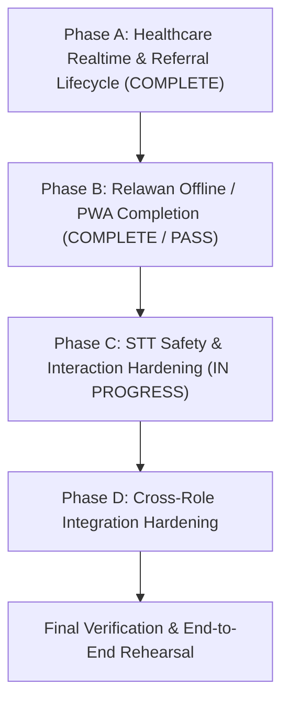

# RAPID-MIND — Technical Architecture & Development Plan

**Project:** RAPID-MIND  
**Document type:** Technical architecture + implementation plan  
**Status:** Working baseline for development  
**Primary source:** `workflow.md`  
**Last updated:** 2026-10-01

---

# Current Demo Sprint Execution Anchor — 1 October 2026

This section defines the **authoritative implementation sequence for the `demo` branch**. It takes precedence over the older broad development-phase ordering (Section 20 below) for day-to-day implementation sequencing. It does NOT replace the permanent architecture, clinical decision-support rules, or UX specifications.

---

## 1. B2C Starting Repository Checkpoint

- **Branch:** `demo`
- **B2C Starting Committed Checkpoint:** `a427fc6d955260af7d0b1efd33604bb81fc82c76` (`feat(relawan): complete phase B2B local-first T0 workflow`).
- **Phase A Main Implementation Checkpoint:** `e778ddfb5f842eab467881f2c15be929290c6a0e` (`feat(healthcare): harden realtime and referral lifecycle`)
- **Prior Healthcare Checkpoint:** `ce38ba6cad97af146a7244d1e8f4835806f14d6e` (`feat(healthcare): complete operational validation and referral workflow`)

### Verification Baseline
- **B2A `AssessmentLocalShellTest`:** `3 passed, 92 assertions`
- **Phase B1 Targeted `RelawanSyncContractTest`:** `15 passed, 121 assertions`
- **B2A Full Laravel Suite:** `114 passed, 1,350 assertions`
- **B2C `AssessmentLocalShellTest`:** `4 passed, 109 assertions`
- **B2C `RelawanSyncContractTest`:** `15 passed, 121 assertions`
- **B2C `RelawanT0SubmissionTest`:** `11 passed, 68 assertions`
- **B2C Full Laravel Suite:** `116 passed, 1,379 assertions`
- **Vue TypeScript:** `./node_modules/.bin/vue-tsc --noEmit` PASS
- **Frontend Production Build:** `npm run build` PASS; standard existing `>500 kB` chunk advisory warning retained (not an error)
- **Git Formatting / Diff Check:** `git diff --check` PASS
- **B2A Antigravity Browser Verification:** **Gates A–L PASS**; no functional browser/runtime error observed in the B2A gate
- **B2C direct Chrome/CDP browser/runtime verification:** **Gates A–F, H–M PASS; Gate G NDV / SOURCE-COVERED; Gate N NDV / SOURCE-COVERED** for the selected prototype scope.
- **Phase A Status:** **COMPLETE / PASS for the directly testable selected prototype scope** (does not represent full production certification, full production hardening, or user manual sign-off)
- **Healthcare Antigravity Browser Verification:** **PASS** for the directly testable selected prototype scope; preserved NDVs and limited-evidence gates are documented in the Phase A verification matrix below.
- **User Manual Final Retest:** **NOT YET PERFORMED** (pending project owner verification prior to final team demo)

### Preserved Phase A Browser Limitations (Preserved as NDV / Documented Constraints)
- **A1-3 Equal-timestamp ID tie-break:** AUTOMATED-ONLY / NDV in browser (verified oldest-first ordering by distinguishable timestamps in DOM; identical-timestamp ID tie-break is covered by automated feature test suite).
- **A2-4 Duplicate-click protection:** PASS WITH LIMITATION / source-supported (UI disables mutation controls while request is in-flight via `busyId` guard; rapid-double-click race condition not directly reproduced as a browser timing test).
- **A2-6 Stale different mutation:** Backend 409 conflict PASS (direct authenticated browser request verified `expected_status: ACTIVE`, `status: ON_SITE` returned HTTP 409 and preserved canonical state `EN_ROUTE`); Natural visible Inertia conflict UI path NDV (forward-only button filtering structurally prevents user from selecting divergent stale action).
- **A2-7 Exact replay idempotency:** HTTP exact replay PASS in authenticated browser runtime; no-duplicate history invariant automated/database-supported, not browser-visual PASS.
- **Historical NDVs Retained:** Missing-phone T0 fallback (B8), T1-before-T2 priority ordering (C4), Same-category FIFO ordering (C5), Historical referral to inactive Faskes (H).

---

## 2. Completed & Stable Functional Areas

The following areas represent the current implemented functional baseline. Verification depth varies by area; known incomplete capabilities remain explicitly assigned to Phases A–D below. Do not broadly redesign these areas unless the active phase requires a focused integration change or a concrete defect is found:

### Foundation
- Laravel 13 + Vue 3 + Inertia.js + TypeScript application structure.
- PostgreSQL + PostGIS spatial infrastructure in Docker Compose.
- Docker Compose service topology (`app`, `queue`, `scheduler`, `reverb`, `nginx`, `postgres`).
- Role-based session authentication with strict `ADMIN`, `RELAWAN`, and `HEALTHCARE` boundary enforcement.

### Relawan Functional Baseline
- Mobile-first Relawan shell, responsive navigation, and header status.
- Psychological First Aid (PFA) Look, Listen, Link guidebook and 5-4-3-2-1 grounding exercises.
- Patient demographic intake and structured assessment session lifecycle.
- SRQ-20 questionnaire (20 binary items with individual question review).
- 5 weighted vulnerability risk factors (R1–R5).
- 3 daily functioning domains (F1–F3, scored 0/1/3).
- Deterministic system triage recommendation engine with auditable component score breakdown and clinical disclaimer.
- Persistent floating T0 Red Flag emergency shortcut and 3-step confirmation/verification modal.
- Client-side IndexedDB/Dexie schema, draft persistence, outbox abstraction, and sync manager baseline.
- Local browser STT foundation using `@huggingface/transformers` 3.8.1, a dedicated Web Worker, and Indonesian Whisper inference with manual SRQ completion always available.
*(Current boundary: B2A, B2B, B2C, and B3A–B3E are complete for the selected prototype scope. Phase C is **IN PROGRESS**: C1/C1B are browser-verified for their selected online scope; C2 and complete offline Whisper runtime verification remain pending.)*

### Healthcare Functional Baseline
- Emergency-first desktop workspace with T0 queue and incident detail view.
- 2-step T0 acknowledgement and secondary tele-verification logging (Phone, Video, Field Team).
- Clinical classification: T0 confirmation or supported clinical downgrade to T1/T2 with free-text diagnosis notes.
- Reporting Relawan contact on selected T0 incident detail via native `tel:` protocol link (with queue privacy).
- Dedicated Validasi Asesmen worklist with segregated `Perlu Divalidasi` and `Selesai` sections.
- Selected validation review displaying full clinical evidence, score breakdown, prior assessments, and clinical disclaimer.
- Immutable stored clinical validation decisions.
- Explicit active-Faskes selection for new non-T0 clinical referrals (rejection of unselected or inactive destinations).
- Patient longitudinal referral history with distinct provenance: `Sumber: Darurat T0` vs `Sumber: Validasi Asesmen`.
- Multi-stage referral dispatch lifecycle tracking and append-only status history.

### Admin Functional Baseline
- Regional command center summary with macro KPI cards and dynamic operational shelter table.
- Interactive MapLibre GL JS geospatial map with shelter/facility markers and detail popups.
- Longitudinal ECharts analytical charts and 30-day mental health trend lines.
- Dedicated master data management for Posko (Shelters) with PostGIS coordinate pair validation.
- Dedicated master data management for Healthcare Organizations (Faskes) with zero-count accuracy.
- Dedicated account provisioning for Relawan (with required Indonesian phone normalization) and Healthcare users (no role selector).
- Strict active-assignment deactivation guards preventing deactivation of Posko/Faskes with active personnel.
- Reassignment audit logs and retained inactive current assignment edge-case handling.

---

## 3. Remaining Execution Sequence

To complete the end-to-end competition prototype safely without scope creep, remaining work is organized into **four sequential implementation phases (Phases A–D)** followed by a final end-to-end verification sequence.



---

### Phase A — Healthcare Realtime + Referral/Dispatch Completion

#### Status
**COMPLETE / PASS for the directly testable selected prototype scope** (Main Implementation: `e778ddfb5f842eab467881f2c15be929290c6a0e`, Coordinate Correction: `a699b8c35f87c5e94cad7448e6e1dd05d7981592`).
*(Note: Covers the current prototype demonstration scope; does not represent full production certification, full production hardening, or user manual sign-off).*

#### Goal
Harden the realtime emergency reception path and complete the operational referral lifecycle from newly triggered T0 emergency through Healthcare response, verification, and terminal completion without requiring manual page reloads.

#### Implemented & Verified Capabilities

##### 1. Healthcare Realtime Reception Hardening
- **Single Subscription Ownership:** `HealthcareLayout.vue` remains the sole owner of the private `emergencies` Reverb subscription. Redundant page-level subscriptions were avoided, preventing duplicate listeners, race conditions, or multiple audio alerts.
- **Push Without Reload:** Newly triggered T0 emergencies update the open Healthcare emergency queue in real time without requiring manual browser refresh.
- **Duplicate Event Suppression:** Broadcast events are deduplicated in memory using a bounded set of stable emergency IDs (`seenIds` up to 100 entries). Repeated broadcast deliveries of the same emergency ID do not trigger duplicate audio alarms or multiple queue rows.
- **Coalesced Reconciliation:** Realtime-triggered reload requests (`requestReconciliation()`) use in-flight locking (`reloadInFlight` / `reloadRequested`) to prevent overlapping, uncontrolled Inertia requests.
- **Reconnect Server Catch-Up:** WebSocket reconnection automatically triggers authoritative server state reconciliation, pulling in any T0 incidents created during an outage.
- **Finite Audio Notification:** Incoming T0 events play exactly one finite Web Audio tone (~0.3s sine wave at 880 Hz). No continuous, looping, or bouncing alert animations were added.
- **No False Reconnection Alarm:** Reconnection reconciliation does NOT trigger audio alerts; audio is strictly reserved for live incoming emergency pushes.
- **Queue Prioritization:** The pending T0 queue strictly prioritizes the oldest unacknowledged emergencies first (FIFO). Equal-timestamp ordering uses stable internal ID tie-breaking, verified via automated test coverage.
- **Payload & Privacy Protection:**
  - Raw `emergencies` channel is restricted to `HEALTHCARE` only; Admin is intentionally excluded from this patient-level realtime channel.
  - `EmergencyCreated` broadcasts only `{ emergency: { id } }` over WebSockets rather than sensitive patient-level payloads.
  - Queue cards conceal volunteer phone numbers; reporter contact info is revealed only on the selected emergency detail page.
- **Server vs. WebSocket Reachability Distinction:**
  - Independent periodic HTTP probe (`/up` every 15s) decouples application server reachability from WebSocket socket state.
  - Three distinct operational states are communicated:
    1. *Realtime aktif* (both server and WebSocket healthy).
    2. *Realtime terputus* (Reverb down, Laravel HTTP server still reachable; displays *"Pembaruan otomatis sementara tidak tersedia. Data mungkin tidak terbaru. Terakhir diperbarui [time]"*).
    3. *Koneksi ke server terputus* (Laravel HTTP unreachable; takes strict precedence over WebSocket state and displays *"Data di layar mungkin tidak terbaru. Terakhir diperbarui [time]"*).
  - Existing loaded queue data remains visible during outages; pages do not collapse into empty states.
  - Recovery of either Reverb or Laravel automatically restores the healthy indicator and reconciles authoritative data.

##### 2. Referral Operational Lifecycle & Concurrency Integrity
- **Canonical Lifecycle Graph:**
  Enforces the approved operational progression:
  ```text
  ACTIVE
  → EN_ROUTE
  → ON_SITE
     ├→ TRANSPORT → COMPLETED
     └────────────→ COMPLETED
  ```
  Valid edges:
  - `ACTIVE → EN_ROUTE`
  - `EN_ROUTE → ON_SITE`
  - `ON_SITE → TRANSPORT`
  - `ON_SITE → COMPLETED` (optional direct completion without transport)
  - `TRANSPORT → COMPLETED`
  All backward transitions and state skips are rejected. `COMPLETED` is terminal.
- **Centralized Domain Logic:** Progression rules centralized in `App\Enums\ReferralStatus::canTransitionTo()`.
- **Concurrency & Pessimistic Locking:** Database mutations execute within a database transaction with `Referral::whereKey($id)->lockForUpdate()`.
- **Expected-Status Assertion:** Client requests pass `expected_status` alongside target `status`. Stale requests attempting different transitions are rejected with HTTP 409 Conflict without overwriting canonical state.
- **Idempotent Replay Support:** Exact replay requests (`expected_status` matching prior state, target `status` already applied) return HTTP 200 without duplicating history rows.
- **Immutable Status History:** Every accepted status mutation transactionally appends exactly one record to `referral_status_histories`.
- **Forward-Only UI Controls:** The interface renders only legitimate next action buttons for the current state (`nextReferralActions()`), blocking illegal transitions at the UI layer.
- **Terminal Confirmation:** Transitioning to `COMPLETED` requires concise explicit confirmation via a confirmation dialog.
- **Neutral Operational Terminology:** Uses approved neutral Indonesian labels:
  - `Aktif`
  - `Menuju lokasi`
  - `Tiba di lokasi`
  - `Transportasi`
  - `Selesai`
  *(Misleading legacy terminology such as "Ambulans Menuju Posko", "Tiba di Posko", "Selesai di RS", and "Diterima RS" has been eliminated).*

##### 3. Architectural Caveat: Combined Referral Progression vs. Future Dispatch Domain
- **Explicit Domain Scope:** The current Phase A implementation hardens the existing combined prototype referral/operational progression within the `Referral` model and `ReferralStatus` enum.
- **No Separate Dispatch Domain Claimed:** Phase A does NOT introduce an independent `EmergencyDispatch` model, dedicated ambulance/vehicle registry, fleet management, response-team entity, or dispatch-team CRUD. The dedicated UX specifications still conceptually distinguish Referral from Dispatch/response team. The prototype currently unites these concepts in a hardened operational lifecycle.

##### 4. Coordinate Rendering Corrective Fix & Retest
- **Runtime Defect Discovered:** During the initial Phase A browser verification run on demo-seeded incident `81b5391a-9632-528b-a211-12a907125561` ("Bambang Sudarmono"), non-null decimal coordinates caused a client-side exception: `TypeError: latitude.toFixed is not a function`.
- **Root Cause:** Laravel's `decimal:8` model attribute casts serialize coordinates as string primitives in Inertia JSON payloads, while the component invoked `.toFixed()` directly.
- **Corrective Commit:** `a699b8c35f87c5e94cad7448e6e1dd05d7981592` (`fix(healthcare): normalize emergency coordinate rendering`).
- **Correction Details:** `resources/js/Pages/Healthcare/Emergencies/Show.vue` introduces `parseCoordinate()` and `formatCoordinates()` to safely normalize numbers/strings to finite numbers, format with 4 decimal places, and provide a clean fallback (`"Sesuai Posko"`) for missing or non-finite values.
- **Corrective Browser Retest Results:**
  - Decimal-string coordinate rendering (`-7.6892, 110.4234`) — `PASS`
  - Missing/null coordinate fallback (`Sesuai Posko`) — `PASS`
  - Normal emergency detail regression — `PASS`
  - Healthcare emergency queue smoke — `PASS`
  - Healthcare referral worklist smoke — `PASS`
  - Runtime / console errors: `0`

##### 5. Phase A Browser Verification Matrix Summary

| Gate | Description | Browser Verification Status | Evidence / Notes |
| :--- | :--- | :--- | :--- |
| **A1-1** | Initial Healthy Realtime State | **PASS** | "Realtime aktif", 0 warnings, queue loaded, private auth 200 OK |
| **A1-2** | Realtime T0 Push Delivery | **PASS** | Auto-delivery without reload, pending count 2→3, finite audio (1 tone), no focus stealing |
| **A1-3** | Queue FIFO Priority Ordering | **PASS** | Oldest unacknowledged T0 rendered first; ID tie-break automated-only / NDV in browser |
| **A1-4** | Queue vs Detail Contact Privacy | **PASS** | Queue conceals phone number; detail page exposes volunteer name, phone, and `tel:` action |
| **A1-5** | Reverb-Only Outage State | **PASS** | Reverb stopped: shows "Realtime terputus" + stale notice; "Koneksi ke server terputus" absent; data preserved |
| **A1-6** | T0 Persists During Reverb Outage | **PASS** | Emergency saved to DB; Relawan shows fallback warning; Healthcare does not receive event while down |
| **A1-7** | Reconnection Catch-Up | **PASS** | Reverb restarted: returns to "Realtime aktif", missed T0 reconciled into queue (count 3→4), 0 audio calls |
| **A1-8** | Duplicate Event Suppression | **PASS** | Immediate duplicate broadcast rejected by `seenIds`; audio alert sounded exactly once; single DOM card |
| **A1-9** | Server Unreachable Precedence | **PASS** | App container stopped: `/up` probe fails, "Koneksi ke server terputus" takes precedence over open WebSocket |
| **A1-10**| Server Recovery & Resumption | **PASS** | App container restarted: `/up` probe recovers, queue reconciles, returns cleanly to "Realtime aktif" |
| **A2-1** | Valid Next Action: ACTIVE | **PASS** | Only "Mulai menuju lokasi" displayed; subsequent buttons strictly hidden |
| **A2-2** | Progression: EN_ROUTE → ON_SITE | **PASS** | Transition succeeds without page reload; status updates to "Tiba di lokasi" |
| **A2-3A**| Transport Progression Branch | **PASS** | ON_SITE exposes both actions; ON_SITE → TRANSPORT → Selesaikan; confirmation modal confirmed; terminal state |
| **A2-3B**| Non-Transport Direct Completion | **PASS** | ON_SITE → Selesaikan directly; confirmation modal confirmed; terminal state without transport required |
| **A2-4** | Duplicate-Click Protection | **PASS WITH LIMITATION** | Source-supported via `busyId` button disablement; timing race not directly browser reproduced |
| **A2-5** | Dual-Browser Canonical Update | **PASS** | Browser A advances ACTIVE → EN_ROUTE; Browser B retains stale view |
| **A2-6** | Stale Different Mutation | **PASS (Backend) / NDV (UI)**| Authenticated POST rejected with HTTP 409 Conflict; natural visible UI conflict NDV due to forward-only gating |
| **A2-7** | Exact Replay Idempotency | **PASS (HTTP) / automated + database-supported** | Authenticated browser-runtime replay returns HTTP 200; no-duplicate history invariant is covered by automated tests and database inspection, not browser-visual verification |
| **Sec 9** | Neutral Operational Wording | **PASS** | Rendered labels verified: Aktif, Menuju lokasi, Tiba di lokasi, Transportasi, Selesai; legacy terms absent |
| **Sec 14** | Referral Provenance & History | **PASS WITH LIMITATION** | Browser directly verified assessment-validation provenance and the rendered status-history trail; distinct T0-vs-assessment provenance and append-only integrity remain additionally covered by source/automated tests |
---

### Phase B — Relawan Offline/PWA Completion

#### Status

**COMPLETE / PASS for selected prototype scope — B1, B2A, B2B, B2C, and B3A–B3E complete**

Phase B is intentionally divided into implementation checkpoints, with B2A/B2B/B2C as checkpoints inside B2:

```text
B1 — Local Data & Replay Contract
COMPLETE / PASS
↓
B2A — Local-first normal assessment workflow
COMPLETE / PASS
↓
B2B — Local-first T0 emergency workflow
COMPLETE / PASS for selected prototype scope
↓
B2C — Shell/Data/synchronization operational integration
COMPLETE / PASS for selected prototype scope
↓
B3 — PWA Shell & Offline Browser Verification
COMPLETE / PASS for selected prototype scope — B3A–B3E complete
```

These checkpoints must be completed in order.

The split is deliberate. B2A and B2B connect the existing IndexedDB and outbox contract to the visible assessment and T0 workflows. B2C connects shell/Data to owner-scoped local state and has passed the selected browser/runtime gates. A Service Worker must not be used to hide or compensate for an incomplete local data model.

---

#### Goal

Complete the required field-operational local-first behavior for Relawan so that assessment work and verified T0-Suspect events remain safe on the device, survive interruption/reload/restart where applicable, and synchronize deterministically when server access returns.

The required conceptual write path is:

```text
Relawan interaction
↓
local IndexedDB persistence
↓
local domain record
↓
outbox / synchronization state
↓
Laravel server reconciliation
↓
canonical PostgreSQL state
```

Not:

```text
Relawan interaction
↓
Laravel request
↓
database
↓
local recovery only after failure
```

Local persistence, server acceptance, synchronization, and realtime delivery remain separate states.

---

#### Phase B Existing Foundation

The following implementation already exists and must be reused where sound:

- `resources/js/offline/db.ts`
  - Dexie database;
  - local patient, assessment, emergency, and outbox stores.
- `resources/js/offline/assessmentDraft.ts`
  - serialized local SRQ/Risk/Function draft writes;
  - draft validation;
  - local/server draft merge helpers.
- `resources/js/offline/syncManager.ts`
  - outbox infrastructure;
  - priority field;
  - online and visibility-triggered synchronization hooks;
  - manual synchronization support.
- SRQ-20, Faktor Risiko, and Fungsi Harian pages already persist meaningful answer changes locally.
- TypeScript triage domain logic already exists under `resources/js/domain/triage/`.
- `/relawan/data` already exposes the current server-backed assessment workspace and a manual synchronization action.
- T0 verification UI already exists.
- Backend T0 validation already supports:
  - identified patient context;
  - assessment-derived patient context;
  - unidentified emergency context;
  - GPS-independent creation.
- SMS fallback is already represented as a native/device composer handoff rather than guaranteed automatic SMS delivery.
- Existing backend assessment validation and server-side triage calculation remain canonical.

These foundations must not be discarded through a broad rewrite unless a concrete correctness problem requires replacement.

---

#### Current Checkpoint Status and Remaining Gaps

Source inspection and verification establish the following Phase B checkpoint status and remaining gaps.

##### B2A normal assessment workflow

**COMPLETE / PASS.** The normal Relawan assessment path now creates stable patient and assessment UUIDs locally, persists Identity/SRQ-20/Risk/Function work to IndexedDB first, calculates the recommendation with the existing TypeScript triage domain, marks the assessment `COMPLETED` locally, queues priority-2 `ASSESSMENT`, and renders the local Result before server synchronization. B1 synchronization later reconciles canonical Laravel/PostgreSQL state. Existing server stage endpoints remain available; the active local-first UI path does not depend on them for stage progression.

The B2A path also supports existing server assessment bootstrap, valid local-answer precedence during merging, incomplete-assessment resume, and exclusion of completed-but-unsynchronized work from unfinished drafts. Patient ownership and same-shelter/creator access rules remain enforced.

##### B2B local-first T0 emergency workflow

**COMPLETE / PASS for the selected prototype scope.** First tap on T0 DARURAT opens verification without creating or transmitting an emergency. Manual/global T0 begins with no Red Flag selected; the explicit KIRIM T0-SUSPECT action is required. Q17 manual escalation may suggest SUICIDAL_IDEATION but still requires that final action.

The visible path now generates a stable client emergency UUID, commits LocalEmergency and a priority-1 EMERGENCY outbox item to IndexedDB, and shows a local active T0-Suspect before attempting synchronization through the existing B1 `/relawan/sync/emergencies` contract. Failed transmission preserves the local event and outbox; retry reuses the same UUID. The unsynchronized active T0 cannot be dismissed through the ordinary return action. SYNCED permits navigation and means server receipt, not Healthcare clinical validation. GPS may be unavailable; unidentified emergencies remain valid. Patient and assessment dependencies keep their stable UUIDs, including a local-only assessment reconciled through one server IN_PROGRESS shell. The legacy `POST /relawan/emergencies` route remains for compatibility. The single `red_flag_type` contract, browser/native SMS handoff, and existing schema remain unchanged.

Automated/source checks: `RelawanT0SubmissionTest` 11 passed; `RelawanSyncContractTest` 15 passed; full Laravel suite 115 passed; Vue typecheck, production build, and `git diff --check` passed. The build retained the existing >500 kB chunk advisory. Antigravity Chrome/CDP Gates A–N and the Q17 regression check passed. A blocked sync left a priority-1 failed outbox and locally active T0; restored sync returned HTTP 201, set the same UUID to SYNCED, and removed the outbox item. Exact replay returned HTTP 200 with one canonical EmergencyEvent and one logical Healthcare queue entry. The browser gate did not independently instrument Reverb delivery; first-creation-only EmergencyCreated dispatch remains automated-contract evidence. Native OS SMS composer launch was not directly verified in the desktop environment. B3 offline reload/reopen/startup, concurrent duplicate replay under load, and Phase C STT safety hardening remain outside B2B.

##### B2C shell, Data, and synchronization operational integration

**COMPLETE / PASS for the selected prototype scope.** The Relawan shell reads owner-scoped local/outbox state reactively and uses the sync manager for startup, network restoration, visibility restoration, new queue entries, and manual retry. The Data workspace presents incomplete, pending/failed, and synchronized local/server records deduplicated by type and stable UUID. Pending T0 remains visible without replacing the workspace, Beranda resumes local incomplete work, and local-write failures use a truthful `Data belum tersimpan di perangkat` state.

Direct Chrome/CDP browser/runtime verification at `http://localhost:8080` passed Gates A–F and H–M. Gate G visibility restoration and Gate N local-write failure are **NDV / SOURCE-COVERED**. The exact compact synchronized shell wording is `Tersinkron`.

Verified B2C behavior includes priority-1 `EMERGENCY` transmission before priority-2 `ASSESSMENT`, genuine CDP offline/online restoration with automatic HTTP 201 reconciliation and stable UUID retention, online startup with assessment-only backlog, manual retry, request-level concurrent trigger guarding with one in-flight request, local/server deduplication, two-Relawan non-destructive isolation, local incomplete draft resume, immediate post-T0 local safety rendering, separate clinical/transmission/Healthcare axes, and Q17 explicit-confirmation regression.

The B2C gate was direct browser/runtime evidence, not an automated browser E2E suite. B3 Service Worker/PWA work, offline reload/reopen/cold startup, PWA installation, and Background Sync remain pending; Phase C STT safety hardening, broader concurrent replay/load testing, production security, and clinical certification remain outside this checkpoint.

The Relawan shell now combines owner-scoped reactive local/outbox reads with actual `syncManager` execution state and a runtime-only local-write failure signal. Its compact status opens the Status Data sheet; online startup, network restoration, visibility restoration, new queue entries, and manual retry use the existing manager. A pending T0 remains visible in Data without replacing the whole workspace.

`/relawan/data` now groups incomplete local work, pending/failed assessment and T0 work, and synchronized history. The synchronized group merges owner-scoped server assessment/T0 history with local SYNCED records by type and stable UUID. Beranda resumes the latest local incomplete assessment and no longer uses server-save, hardcoded Posko, or medical-pickup wording. Missing recommendation/score remains unavailable rather than becoming T3 or 0/37.

##### B3 delivery status

**IN PROGRESS.** B3A, B3B, B3C, and B3D are **COMPLETE / PASS for the selected prototype scope**. B3D directly verified the reconnect/session-recovery boundary, auth-aware T0-priority synchronization, stable canonical reconciliation, and browser-wide same-owner synchronization ownership. B3E remains **NOT STARTED**.

The standalone installed-PWA cross-window Web Locks gate remains **NOT DIRECTLY VERIFIED** because the Chrome/CDP environment did not have an OS-installed standalone PWA shell. Same-origin multi-tab Web Locks behavior was directly verified. This limitation does not invalidate B3D for the selected prototype scope and does not constitute all-browser, production concurrency/load, production security, or clinical certification.

---

#### B1 — Local Data & Replay Contract

##### Goal

Establish the durable local domain model and deterministic server replay contract before changing the visible Relawan workflow.

B1 is primarily a correctness and data-integrity checkpoint.

---

##### B1.1 Account-Isolated Local Storage

The Relawan local data layer must be isolated by authenticated account.

Required behavior:

```text
Relawan A local data
≠
Relawan B local data
```

A Relawan account must not read, display, or synchronize another account's local:

- patients;
- assessments;
- emergencies;
- outbox records;
- synchronization metadata.

The implementation may use an appropriately account-scoped database/repository strategy, but account isolation is a required behavior rather than an optional optimization.

Do not store the user's normal password, refresh credential, or long-lived authentication credential in IndexedDB merely to support offline work.

Fresh offline login remains outside the current prototype scope.

---

##### B1.2 Stable Client UUID Strategy

Major locally created entities must receive stable UUIDs before server synchronization:

```text
patient
assessment
emergency event
```

The same UUID must survive:

```text
local creation
→ browser/PWA interruption
→ retry
→ synchronization
→ exact replay
```

Do not generate a different server identity merely because synchronization is retried.

---

##### B1.3 Local Repositories

Introduce focused local repository/service boundaries for at minimum:

```text
patient
assessment
emergency
outbox
```

Do not place all offline behavior into one large component or one oversized utility file.

Assessment repositories must preserve:

- patient context;
- assessment identity;
- mode;
- SRQ answers;
- risk answers;
- function answers;
- local triage result where complete;
- workflow/completion state;
- local timestamps;
- synchronization state.

Emergency repositories must preserve:

- stable emergency UUID;
- patient/assessment context when available;
- Red Flag reason;
- notes;
- coordinates when available;
- local creation timestamp;
- local operational state;
- synchronization state.

---

##### B1.4 Canonical Assessment Synchronization Payload

Do not model offline assessment synchronization as a fragile sequence of unrelated replay operations for every individual stage.

Prefer one canonical assessment synchronization contract containing the necessary assessment aggregate, including where applicable:

```text
assessment UUID
patient UUID + patient identity
mode
SRQ answers
risk answers
function answers
completion state
client-calculated triage result / metadata
```

The server remains authoritative.

The server must:

1. validate the payload;
2. reconcile/create the patient using the stable patient UUID;
3. reconcile/create the assessment using the stable assessment UUID;
4. persist structured response sets transactionally;
5. recalculate triage using the PHP domain implementation;
6. store the canonical server triage result;
7. return canonical server state for local reconciliation.

The server must never trust the client-provided score as authoritative.

---

##### B1.5 Idempotent Assessment Replay

Assessment synchronization must support deterministic replay.

Required behavior:

```text
first valid UUID submission
→ create/reconcile canonical server record

same UUID + same logical payload replay
→ success
→ no duplicate logical record

same UUID + conflicting incompatible payload
→ explicit deterministic conflict
```

Do not silently create a second assessment because the client retried after an uncertain network response.

Existing uniqueness constraints for SRQ, risk, function, and triage records should be preserved and reused where appropriate.

---

##### B1.6 Idempotent Emergency Replay

T0 synchronization requires stronger guarantees because duplicate replay can produce duplicate operational alerts.

Required behavior:

```text
new emergency UUID
→ create one emergency
→ publish one Healthcare emergency event

same UUID + exact replay
→ return existing successful state
→ do not create another emergency
→ do not publish another Healthcare alert

same UUID + conflicting incompatible replay
→ reject explicitly
```

The locally generated emergency UUID becomes the server emergency UUID.

Emergency acceptance must reconcile local dependencies without waiting for routine assessment synchronization. A priority-1 `EMERGENCY` operation must be eligible to synchronize before any priority-2 `ASSESSMENT` operation.

If the emergency identifies a locally created patient, its emergency payload must carry sufficient patient identity data together with the stable patient UUID. The server transaction must reconcile or create that patient before creating the emergency.

If the T0 originated from a local assessment whose UUID does not yet exist on the server, the emergency transaction may reconcile or create only the minimum `IN_PROGRESS` assessment identity required to preserve the emergency relationship. This emergency dependency reconciliation must not synchronize SRQ, risk, function, or routine assessment completion data.

The later priority-2 canonical `ASSESSMENT` aggregate must reconcile into that same stable assessment UUID rather than creating another assessment. An unidentified T0 remains valid without patient or assessment dependencies.

Idempotent emergency replay rules apply to the entire dependency-reconciliation transaction: exact replay must neither duplicate the emergency nor broadcast another Healthcare alert. This is dependency reconciliation for emergency acceptance, not routine assessment synchronization.

---

##### B1.7 Outbox Operation Model

The outbox must represent real synchronizable domain operations rather than unused generic placeholders.

At minimum:

```text
EMERGENCY
ASSESSMENT
```

Priority ordering remains:

```text
EMERGENCY  → priority 1
ASSESSMENT → priority 2
```

The `PATIENT` operation must not remain a misleading partially supported queue type.

Either:

- implement a real independent patient synchronization contract when genuinely required;

or preferably for the current MVP:

- synchronize patient identity as part of the canonical assessment aggregate where appropriate.

Do not retain an outbox type that can be queued but never processed.

---

##### B1.8 Synchronization Metadata

The local data layer must distinguish at least:

```text
locally saving
locally saved
pending synchronization
synchronizing
synchronized
previous synchronization failed
local persistence failed
```

A failed server synchronization must not imply local data loss.

A successful server synchronization must reconcile the relevant local entity before its outbox operation is considered fully complete.

Do not simply delete the outbox item without updating the local domain record's canonical synchronization state.

---

##### B1.9 Shared Request Transport

Relawan synchronization requests must use one consistent same-origin request mechanism that correctly carries the application's required browser authentication/CSRF context.

Do not duplicate ad-hoc request-header logic across every assessment stage.

B1 must specifically verify that normal browser synchronization does not fail because of missing CSRF/session context.

---

##### B1 Verification Gate

Automated/server-side tests must cover at minimum:

- first assessment synchronization creates one canonical assessment;
- exact assessment replay does not duplicate the assessment;
- conflicting incompatible assessment replay is deterministic;
- server triage is recalculated rather than trusted from the client;
- first emergency synchronization creates one emergency;
- exact emergency replay produces one emergency only;
- exact emergency replay does not broadcast a second Healthcare alert;
- conflicting emergency replay is rejected explicitly;
- Relawan ownership/role boundaries remain enforced;
- malformed synchronization payloads do not corrupt existing server state.

Existing Phase A and previous Relawan/Healthcare behavior must remain green.

B1 does **not** claim complete browser offline operation yet.

##### B1 Completion and Evidence

**COMPLETE / PASS for the selected prototype scope.** B1 establishes:

- account-scoped IndexedDB repository access with `owner_user_id`;
- stable client UUIDs for patient, assessment, and emergency synchronization;
- focused patient, assessment, emergency, and outbox repositories;
- outbox operation types limited to `EMERGENCY` and `ASSESSMENT`, with priorities 1 and 2 respectively;
- coalesced/revisioned outbox entries and synchronization state/error metadata;
- serialized follow-up synchronization when work is queued during an active run;
- retry distinction for transient/session failures versus deterministic conflict/input failures;
- shared same-origin CSRF-aware JSON mutation transport;
- authenticated Relawan endpoints `POST /relawan/sync/assessments` and `POST /relawan/sync/emergencies`;
- canonical PHP triage recalculation and deterministic assessment/T0 replay;
- no second Healthcare alert on exact emergency replay;
- local-only patient dependency reconciliation;
- minimal `IN_PROGRESS` assessment shell creation for priority-1 T0 when needed;
- later priority-2 assessment reconciliation into the same stable assessment UUID.

The corrected replay semantic is important: `assessment_mode` used to create a missing T0 assessment shell is dependency context, not immutable emergency replay identity. An exact T0 replay remains valid even if the linked assessment later changes mode during canonical assessment synchronization.

The focused authenticated browser/session gate exercised the running Nginx/Laravel application with the real CSRF/session transport. Assessment synchronization returned HTTP 201 with the client assessment and patient UUIDs preserved, `IN_PROGRESS`, and `created = true`; the exact replay returned HTTP 200 with the same IDs and no duplicate logical assessment. Emergency synchronization returned HTTP 201 with the client emergency UUID and assessment relationship preserved, `created = true`; the exact replay returned HTTP 200 with `replayed = true` and the same emergency UUID. This was not a full offline/PWA browser gate.

Automated evidence: `RelawanSyncContractTest` **15 passed, 121 assertions**; full Laravel suite **111 passed, 1,258 assertions**. Vue TypeScript, production build, and `git diff --check` also passed. The build retained the standard existing `>500 kB` chunk advisory warning; it is not an error.

Retained limitations:

- Populated Dexie v1 to v2 migration is source/static verified, but a previously populated real browser v1 database was not directly runtime-tested through the v2 upgrade.
- Server-side concurrency protection exists, but concurrent duplicate replay under real load was not load-tested.
- At the B1 checkpoint, the visible Relawan assessment/T0 workflow was not yet fully local-first; this was the B2 handoff. B2A/B2B have since passed for the selected prototype scope.
- Offline reload/reopen, Service Worker shell, and complete disconnect/reconnect workflow are not yet verified; this belongs to B3.

---

#### B2 — Relawan Local-First Workflow Integration

##### Goal

Connect the B1 data/replay contract to the real Relawan UI so the field workflow uses IndexedDB as the primary durability boundary.

Checkpoint mapping:

| Checkpoint | Scope | Status |
|---|---|---|
| B2A | Normal local-first assessment integration; B2.1–B2.5 | **COMPLETE / PASS** |
| B2B | Local-first T0 emergency integration; B2.6–B2.7 and applicable SMS/T0 transmission contract | **COMPLETE / PASS** |
| B2C | Shell, Data, and synchronization operational integration; B2.8–B2.10 | **COMPLETE / PASS for selected prototype scope** |
| B2 | All three checkpoints above | **COMPLETE / PASS for selected prototype scope** |

B2A/B2B/B2C evidence does not claim true offline page reload/reopen/startup; that remains a B3 verification boundary.

---

##### B2.1 Local-First Assessment Creation

Starting a new assessment must no longer require the server to create its identity first.

Required sequence:

```text
Relawan starts assessment
→ stable patient identity resolved/created locally
→ stable assessment UUID created locally
→ assessment stored in IndexedDB
→ focused assessment workflow begins
→ server synchronization occurs separately
```

An existing remotely known patient may be reused where available and safe.

A new local patient must remain usable while disconnected.

---

##### B2.2 Identity Stage

Resolve the existing route/screen inconsistency around:

```text
/relawan/assessment/:assessmentId/identity
```

The MVP identity stage must exist and be capable of operating from the local assessment/patient repositories.

Do not turn it into a separate patient-management module.

---

##### B2.3 Assessment Stage Persistence

SRQ-20, Faktor Risiko, and Fungsi Harian must use the canonical local assessment as their durability source.

Every meaningful answer remains locally persisted immediately.

Advancing between stages must not require successful server synchronization.

Expected behavior:

```text
answer
→ local save
→ continue

stage complete
→ update local assessment
→ continue to next stage
```

Server synchronization is separate.

Do not clear locally authoritative answers merely because one server request succeeds.

---

##### B2.4 Local Review and Triage Result

A complete local assessment must be reviewable and calculable without server access.

Use the existing TypeScript triage domain implementation.

Do not reimplement triage thresholds directly inside Vue view components.

Required flow:

```text
SRQ complete
+
Risk complete
+
Function complete
↓
TypeScript triage calculation
↓
local recommendation displayed
↓
assessment marked locally complete
↓
ASSESSMENT outbox operation pending
```

The result remains a system recommendation.

The synchronized server result remains canonical after Laravel recalculation.

---

##### B2.5 Draft and Restart Recovery

Local incomplete assessments must be discoverable after interruption.

Required states remain distinct:

```text
Sedang Dikerjakan
Belum Selesai
Menunggu Sinkronisasi
```

Completed-but-unsynchronized work must not be represented as an unfinished draft.

Multiple incomplete assessments remain allowed.

---

##### B2.6 T0 Local-First Creation

After explicit Relawan verification:

```text
validate required input
→ generate/reuse stable emergency UUID
→ persist emergency locally
→ enqueue EMERGENCY priority 1
→ show locally safe active incident state
→ attempt server synchronization
```

Network failure must never remove the locally stored emergency.

GPS failure must not block local emergency creation.

Patient identity may remain unknown where the approved emergency workflow permits it.

---

##### B2.7 Local Active T0 State

The active T0 view must be capable of rendering the local emergency before server receipt.

It must never hardcode server success.

Transmission copy must derive from actual state, for example:

```text
Tersimpan di perangkat
Menunggu sinkronisasi
Menyinkronkan
Diterima server
Sinkronisasi belum berhasil
```

Healthcare acknowledgement/validation remains a separate operational state.

---

##### B2.8 Real Shell Synchronization State

`RelawanLayout.vue` must consume the actual synchronization/local persistence state rather than only `navigator.onLine`.

The shell must never show:

```text
Tersinkron
```

while relevant outbox work remains.

Expected high-level states include:

```text
Tersinkron
Menyinkronkan N data…
Offline • N data tersimpan
N data menunggu sinkronisasi
Sinkronisasi belum berhasil
Data belum tersimpan di perangkat
```

Raw connectivity and data durability must remain distinct.

---

##### B2.9 Data Workspace

Extend `/relawan/data` into the operational local-data workspace defined by the final UX handoff.

It should truthfully represent local and synchronized state such as:

```text
Sedang Dikerjakan / Belum Selesai
Menunggu Sinkronisasi
Tersinkron
failed previous synchronization where applicable
pending T0 incidents
```

Manual `Sinkronkan` remains supplemental.

Automatic synchronization remains the normal behavior.

Do not expose low-level database implementation details to the user.

---

##### B2.10 Synchronization Triggers

Supported synchronization triggers should include where practical:

```text
new queued submission
network restoration
application startup
application resume / visibility restoration
manual retry
```

Duplicate concurrent sync runs must remain guarded.

Emergency operations must be processed before routine assessment operations.

---

##### B2.11 SMS Handoff

Retain the existing safe browser/device SMS handoff.

The application may claim:

```text
composer SMS dibuka
```

where observable.

It must not claim:

```text
SMS berhasil dikirim
```

without actual confirmation.

Do not introduce native automatic SMS sending in Phase B.

---

##### B2 Verification Gate

Before B3, verify through source/tests and browser runtime where possible:

- new local assessment receives stable UUID before synchronization;
- meaningful answers persist locally immediately;
- stage navigation does not require server success;
- local triage result is calculated using the TypeScript domain implementation;
- locally completed assessment enters assessment outbox;
- verified T0 is persisted locally before any transmission attempt;
- T0 receives priority 1;
- routine assessment receives priority 2;
- shell count/state comes from real local/outbox data;
- `/relawan/data` displays truthful pending/local state;
- synchronization success reconciles local records;
- synchronization failure leaves data locally safe;
- switching Relawan accounts does not expose another account's local records.

Full offline page reload/startup is not claimed until B3 is complete.

---

#### B3 — PWA Shell & Offline Browser Verification

##### Goal

Add the minimum approved production PWA/runtime layer after the local-first domain workflow is already correct.

##### Current Delivery Status — 1 October 2026

```text
Phase B3A — COMPLETE / PASS
Phase B3B — COMPLETE / PASS
Phase B3C — COMPLETE / PASS for selected prototype scope
Phase B3D — COMPLETE / PASS for selected prototype scope
Phase B3E — NOT STARTED
Phase C offline STT — NOT STARTED
```

B3C covers the verified server-unavailable Relawan runtime through owner-scoped local data, PFA, patient/assessment creation and progression, local triage and Result, T0-Suspect creation, and the pending outbox. B3D subsequently completed the reconnect/synchronization lifecycle for the selected prototype scope through three verified areas: B3D.1 server/session recovery boundary, B3D.2 auth-aware T0-priority synchronization, and B3D.3 browser-wide same-owner synchronization ownership.

The authoritative B3C acceptance evidence is the later Chrome test with the local Nginx service genuinely stopped. The earlier CDP-only Antigravity attempt is not the final B3C result because the renderer and localhost Service Worker network path were isolated differently and produced cascading failures.

---

##### B3D — Reconnect, Session Recovery, and Browser-Wide Synchronization Ownership

**COMPLETE / PASS for the selected prototype scope.** This result combines direct real-browser verification of B3D.1/B3D.2 with direct Chrome/CDP verification of B3D.3. It is not production hardening, production security certification, production concurrency/load certification, an all-browser Web Locks guarantee, a full automated browser E2E suite, or clinical certification.

###### B3D.1 / B3D.2 browser/runtime evidence

The authoritative browser run used genuine Nginx/Laravel unavailability and reported **Gates A–J PASS**. It directly verified:

- offline assessment and T0 creation followed by server restoration;
- same-owner `/relawan/session-status` recovery;
- transition from the static offline runtime through a genuine Laravel/Inertia `/relawan/data` document before synchronization;
- no clinical POST directly from the static offline shell;
- priority-1 T0 emergency synchronization before the routine assessment;
- stable client/server UUID reconciliation, one canonical assessment, one canonical emergency, and exactly one Healthcare T0 incident;
- no duplicate canonical records after replay/reload;
- expired-session transition to `REAUTHENTICATION_REQUIRED`, with IndexedDB/outbox preserved through explicit `/login?reauth=1` reauthentication;
- wrong-Relawan and wrong-role isolation;
- retryable T0 failure preventing routine assessment overtaking;
- HTTP 419 recovery through a fresh Laravel/CSRF document context;
- truthful server-unavailable probe behavior;
- offline logout preserving `logout_pending`; and
- permanent HTTP 422 conflict remaining preserved and non-looping.

The observed transmission order was:

```text
POST /relawan/sync/emergencies
→ HTTP 201

then

POST /relawan/sync/assessments
→ HTTP 200
```

Both operations retained their stable client UUIDs as canonical server UUIDs, and Healthcare received one logical T0 incident.

###### B3D.3 implementation and browser/runtime evidence

The client sync manager uses the native Web Locks API around the entire synchronization critical section with the browser-managed, exclusive, owner-scoped namespace:

```text
rapid-mind:relawan-sync:<owner>
```

The lock complements rather than replaces the same-runtime `isSyncing` / `syncRequested` guard, Dexie owner/revision protection, stable UUID and server idempotency contracts, and PostgreSQL advisory identity locking. No outbox schema, backend synchronization contract, or dependency changed. Browsers without Web Locks retain the existing same-runtime, Dexie, and backend-idempotency fallback; browser-wide serialization is not claimed for that fallback.

Direct Chrome/CDP acceptance used Chrome/Chromium `154.0.8037.92`, with the Web Locks API and `navigator.locks.query()` available:

| Gate | Scope | Result |
|---|---|---|
| A | Two tabs / one processor | **PASS** |
| B | Delayed-holder serialization | **PASS** |
| C | Trigger storm | **PASS** |
| D | Lock handoff | **PASS** |
| E | Owner change while waiting | **PASS** |
| F | Lock-holder disappears | **PASS** |
| G | Canonical duplicate protection | **PASS** |
| H | T0 ordering regression | **PASS** |
| I | No persistent lock artifact | **PASS** |
| J | Installed PWA interoperability | **NOT DIRECTLY VERIFIED** |

While Tab A held `rapid-mind:relawan-sync:19` around a deliberately paused emergency POST, `navigator.locks.query()` showed Tab A holding the exclusive lock and Tab B waiting for the same exclusive lock. Multiple Tab B triggers produced zero clinical POSTs during the held interval. After release, Tab B acquired the lock, re-read Dexie, found no pending records, and emitted no duplicate POST.

The owner-change gate changed active continuity from owner 19 to owner 25 while Tab B waited. On acquisition, `ownerCanSync(19)` returned false. Tab B sent zero clinical POSTs, deleted zero owner-19 outbox records, and preserved owner 19's records.

The dead-tab gate closed Tab A while it held the lock and left one emergency item `SYNCING`. The browser released the Web Lock automatically; Tab B acquired it, recovered stale `SYNCING` to `PENDING`, synchronized the emergency before the assessment, and emptied the outbox without a persistent cleanup flag.

Across the concurrency flows, canonical results remained one patient, one assessment, one emergency, and one Healthcare incident per flow. Exact replay returned `created: false` and `replayed: true`, with no duplicate Healthcare first-creation event observed.

The standalone installed-PWA cross-window gate remains **NOT DIRECTLY VERIFIED** because the automation environment did not have an OS-installed standalone PWA shell. Same-origin multi-tab Web Locks behavior was directly verified; standalone installed-PWA interoperability remains an explicit NDV limitation.

Implementation verification retained for B3D.3:

```text
Focused Laravel tests: 19 passed, 129 assertions
Full Laravel suite: 124 passed, 1,416 assertions
Vue TypeScript: PASS
Production build: PASS
git diff --check: PASS
```

The existing non-fatal large-chunk and PWA/build deprecation advisories remain advisories.

---

##### B3E — Final Source/Build Readiness and Real-Browser Acceptance (1 October 2026)

**COMPLETE / PASS for the selected prototype scope.** The final source/build readiness pass found **no source correction necessary**; the existing implementation already satisfied the requirements and no source/tracked file changed. It verified the valid manifest, `/relawan/` Service Worker scope, neutral `offline.html`, complete offline dependency precache, safe Cache Storage boundary, Dexie clinical/local store, Dexie outbox plus document-side `syncManager` replay, no Workbox Background Sync, owner-scoped Web Lock `rapid-mind:relawan-sync:<owner>`, valid generated PWA artifacts/precache graph, Vue TypeScript, production build, and `git diff --check`.

The authoritative real-browser run used Chrome/Chromium `154.0.8037.92`, `http://localhost:8080`, branch `demo`, HEAD `cee9bffcf4a3463e782ab407c0ace63438e82cc3`:

```text
A Manifest discovery PASS                  B Service Worker registration PASS
C Cache boundary PASS                      D Warm online state PASS
E Genuine server outage PASS               F Offline PFA PASS
G Offline assessment PASS                  H Offline T0 PASS
I Reload/reopen persistence PASS           J Truthful pending state PASS
K Server restoration PASS                  L Session/CSRF restoration PASS
M T0-first ordering PASS                   N Canonical reconciliation PASS
O Healthcare single T0 PASS                P Duplicate protection PASS
Q Final local sync state PASS              R Cross-tab serialization PASS
S Integrated clean end state PASS          T Installed standalone PWA NOT DIRECTLY VERIFIED
```

A genuine Nginx outage verified the complete path from an online Service Worker-controlled Relawan runtime through neutral offline fallback, offline PFA, patient/assessment, local triage, T0-Suspect, IndexedDB/outbox persistence, normal offline reload/reopen, Nginx restoration, `/relawan/session-status`, same-owner authentication, genuine Laravel/Inertia `/relawan/data`, fresh session/CSRF, T0-first synchronization, canonical reconciliation, Healthcare realtime reception, duplicate-safe replay, and final synchronized state.

Synthetic evidence: patient `4217c934-c7fe-442d-9c10-317bdcf79ae1`, assessment `cc31c60f-f706-476e-bae8-e3727ae914ea`, emergency `ef7bc889-5617-4c8b-962e-be3f1c487ac1`; assessment `COMPLETED`, SRQ-20 `6`, Risk `2`, Function `0`, Total `8/37`, recommendation `T2`; outbox Emergency priority `1` / `PENDING`, Assessment priority `2` / `PENDING` before reconnect.

Observed ordering was `GET /relawan/session-status` → `200 AUTHENTICATED`, `GET /relawan/data` → `200 genuine Laravel document`, `POST /relawan/sync/emergencies` → `HTTP 201`, then `POST /relawan/sync/assessments` → `HTTP 200`. The static offline runtime emitted no clinical POST before Laravel document restoration. Cache Storage contained only the neutral/static runtime and no authenticated clinical responses matching `/relawan/data`, `/relawan/assessment/*`, `/relawan/emergencies/*`, or `/relawan/sync/*`; clinical records remained in Dexie. Local and server UUIDs matched, the server contained exactly one patient/assessment/emergency, and exact replay returned the equivalent of `created: false`, `replayed: true` without duplicates.

Healthcare received the emergency through Reverb with `realtime_delivered: true`, one incident card, and zero duplicate cards. The final Relawan state was `Menunggu Sinkronisasi (0)`, Assessment `Tersinkron`, T0 `Diterima server`, outbox `0`. Cross-tab testing retained `rapid-mind:relawan-sync:19`; the waiting tab emitted zero concurrent clinical POSTs and no stranded lock remained.

Final Admin smoke coverage passed `/admin/summary`, `/admin/map`, `/admin/analytics`, `/admin/volunteers`, `/admin/facilities/users`, `/admin/facilities/organizations`, `/admin/operations/posko`, and `/admin/logistics`; the shell, summary, MapLibre map, analytics, and master-data pages rendered with zero fatal console errors and no Relawan offline contamination. Admin had `navigator.serviceWorker.controller = null`; the only relevant worker remained scoped to `/relawan/`. Healthcare was exercised through the realtime T0 gate.

Installed standalone-PWA behavior remains **NOT DIRECTLY VERIFIED** because headless Linux Chrome/CDP could not launch an OS-installed standalone shell, although manifest support and `beforeinstallprompt` were verified. This limitation does not invalidate Phase B for the selected prototype scope and does not claim production security, production concurrency/load, all-browser PWA, complete offline authentication, clinical, or full automated browser E2E certification.

##### B3.1 PWA Integration

Implement the minimum Vite/Workbox-compatible PWA integration required for the prototype.

Required capabilities:

```text
web app manifest
service worker registration
application-shell availability
essential static asset caching
offline Relawan startup after successful prior load/install
```

Do not introduce a large custom Service Worker when standard Vite/Workbox primitives are sufficient.

Dependency installation remains a separate explicit development step.

---

##### B3.2 Sensitive Data Cache Boundary

Do not broadly cache authenticated patient/clinical Inertia responses merely to make navigation appear offline-capable.

Sensitive field data belongs in the account-isolated IndexedDB model.

The Service Worker should principally provide the neutral application/runtime shell and safe static assets required to start the Relawan experience.

Any navigation fallback must avoid creating an uncontrolled second patient-data store in Cache Storage.

---

##### B3.3 Offline Relawan Startup

After the application has previously been loaded successfully:

```text
browser/PWA reopened
→ server unavailable
→ Relawan application shell loads
→ local account context/eligibility is evaluated
→ IndexedDB local work is restored
```

Do not claim fresh offline password authentication.

If existing offline eligibility cannot be established safely, preserve local data without pretending a new server-authenticated session exists.

For the selected B3C prototype scope, normal reload/reopen under an existing controlling Service Worker is the supported acceptance gate. `Ctrl+Shift+R` / hard reload is excluded because it can bypass normal Service Worker behavior.

---

##### B3.4 Offline Functional Scope

Required offline-capable Relawan behavior for the prototype:

```text
PFA content
existing locally cached patient context
new local patient identity
new assessment
SRQ-20
Faktor Risiko
Fungsi Harian
local triage calculation
assessment completion
T0 verification
T0 local creation
local active T0 guidance/state
Data/local sync workspace
```

Server-dependent synchronization and remote Healthcare updates wait until connectivity/server access returns.

---

##### B3.5 Actual Browser Offline Verification

The final Phase B browser gate is:

```text
login while online
→ load/warm Relawan application
→ create or prepare test context
→ switch browser network to Offline
→ create/edit assessment
→ create verified T0-Suspect
→ verify both are safely stored locally
→ reload/reopen while offline
→ verify local assessment and T0 survive
→ verify shell does not claim remote synchronization
→ return network to Online
→ automatic or explicit sync runs
→ verify T0 priority processing before normal assessment
→ verify one canonical server assessment
→ verify one canonical server emergency
→ verify Healthcare receives one T0 incident
→ retry/reload again
→ verify no duplicate server records or duplicate T0 alert
→ verify Relawan local state becomes synchronized
```

Where ordering cannot be proven from visual UI alone, inspect the outbox/runtime/network evidence directly and document the evidence source.

---

##### B3.6 PWA Verification

Also verify directly:

- manifest is discoverable;
- Service Worker registers successfully;
- Service Worker controls the expected Relawan application scope;
- essential application assets are available offline;
- offline startup does not depend on a live Laravel response after the required prior load/install;
- PFA remains usable offline;
- local assessment/T0 restoration works after reload/reopen;
- no false `Tersinkron` state is displayed;
- no sensitive authenticated clinical response is intentionally broadly cached as the PWA shell.

---

#### Phase B Non-Goals

Do not expand Phase B into:

- Phase C STT safety changes;
- new NLP behavior;
- automatic native SMS sending;
- fresh offline password authentication;
- password/credential lifecycle redesign;
- Healthcare UI redesign;
- Admin UI redesign;
- new map/analytics work;
- broad visual redesign;
- large unrelated architecture refactors;
- a new frontend testing framework solely for this phase unless a concrete requirement cannot be verified using existing infrastructure.

The existing STT direct-answer mutation issue remains assigned to Phase C.

---

#### Phase B Completion Criteria

Phase B is **COMPLETE / PASS for the selected prototype scope** because all five checkpoints are complete:

```text
B1 — Local Data & Replay Contract
PASS
↓
B2A — Local-first normal assessment workflow
PASS
↓
B2B — Local-first T0 emergency workflow
PASS
↓
B2C — Shell/Data/synchronization operational integration
PASS
↓
B3 — PWA Shell & Offline Browser Verification
PASS
```

Required final evidence:

1. stable local patient/assessment/emergency UUIDs;
2. account-isolated Relawan local data;
3. complete assessment can be performed and completed locally;
4. local TypeScript triage calculation works offline;
5. complete assessment can enter and survive the outbox;
6. verified T0 is persisted locally before transmission;
7. T0 is synchronized ahead of routine assessment work;
8. exact replay does not create duplicate assessment/emergency records;
9. exact T0 replay does not publish another Healthcare incident;
10. Relawan shell truthfully distinguishes local save, pending sync, syncing, server confirmation, and failure;
11. `/relawan/data` truthfully represents local/pending/synchronized work;
12. Service Worker/PWA shell supports the required offline startup;
13. offline assessment/T0 survives reload/reopen;
14. reconnect synchronizes successfully;
15. authoritative server state is reconciled locally;
16. existing Healthcare/Admin workflows remain regression-free.

Phase B completion does not constitute production security certification, production concurrency/load certification, all-browser PWA certification, installed standalone-PWA certification, complete offline authentication certification, clinical certification, or full automated browser E2E certification.
---

### Phase C — STT Safety & Interaction Hardening

#### Current Status

```text
Phase C — IN PROGRESS

C1 — Local Whisper STT foundation:
IMPLEMENTED / BROWSER VERIFIED for selected online preparation + transcription scope

C1B — Indonesian model accuracy selection:
BROWSER VERIFIED / PASS WITH KNOWN PERFORMANCE LIMITATION

C2 — Transcript interpretation and SRQ auto-answer:
IMPLEMENTED / AUTOMATED VERIFIED / DEMO-CRITICAL BROWSER PATHS PASS

Continuous/chunked one-session recording:
NOT STARTED

Complete offline ONNX runtime verification:
NOT VERIFIED / DEFERRED

WebGPU performance optimization:
DEFERRED
```

#### Current Technical Direction

```text
Local browser STT
→ @huggingface/transformers 3.8.1
→ dedicated Web Worker
→ Indonesian Whisper model
→ WebGPU preferred
→ WASM / CPU fallback
→ browser model caching
→ manual SRQ always remains available
```

The selected model is `cmaree/Bagus-whisper-small-id-onnx` with:

```ts
{
    encoder_model: "q4f16",
    decoder_model_merged: "q4f16",
}
```

Inference requests `language = Indonesian` and `task = transcribe`. C1 remains push-to-talk:

```text
Siapkan STT
→ Mulai Rekam
→ Selesai & Transkripsikan
→ transcript displayed
```

The transcript was display-only at the C1 checkpoint. C2 now passes each non-empty transcript to a separate deterministic Indonesian SRQ interpreter. Only explicit first-person statements or a confidently recognized SRQ question followed locally by `ya`/`tidak` can populate an answer. Question-only text, bare responses, ambiguous overlaps, and conflicting evidence remain unresolved. Accepted answers are applied as one batch and persisted once through the existing `saveAssessmentDraft(..., 'srq_answers', ...)` Dexie path; raw audio and transcripts are not persisted.

Manual selections and restored answers remain authoritative. In-memory session ownership permits STT to update only unanswered items or items populated by STT during the current mounted page session. A manual selection removes STT ownership, and a remount intentionally protects all restored answers.

Q17 uses dedicated affirmative and negative phrase rules. An unambiguous affirmative match may set Q17 and open the existing Potential Red Flag interruption. If a manual/restored answer protects Q17 from that affirmative update, the answer remains unchanged and a safety interruption still appears: review-only when the protected answer is `TIDAK`, or the normal interruption when it is already `YA`. Conflicting transcript evidence also leaves Q17 unchanged and opens the manual safety-review variant. None of these paths creates, submits, or transmits T0; Potential Red Flag, T0 Verification, and the explicit `KIRIM T0-SUSPECT` action remain separate human gates. Manual SRQ completion remains available if STT preparation, microphone access, transcription, or interpretation does not produce a safe match.

#### Current Browser Evidence and Performance Boundary

The tested backend is `WASM / CPU`. Indonesian Whisper Small produced substantially better observed Indonesian transcription than the initial generic multilingual Whisper Tiny runtime proof. A longer SRQ-style utterance took approximately **30 seconds to 1 minute** to produce a transcript in the current test environment. This is a user-observed estimate, not a formal benchmark or RTF measurement; realtime STT is not claimed.

The latency is a known prototype performance limitation. It is deferred until after the 4 October MVP deadline so the current work can prioritize MVP completion.

`navigator.gpu` existed in both Brave and Google Chrome on the current Kubuntu/Linux test environment, and `brave://gpu` reported WebGPU and WebGPU interop as hardware accelerated. However, `navigator.gpu.requestAdapter()` returned no usable adapter for default, `low-power`, or `high-performance` requests in both browsers. Application inference therefore used `WASM / CPU`. This does not claim WebGPU is universally unavailable; WebGPU/Linux/browser/driver optimization is deliberately deferred.

#### C2 Safety and Interaction Boundaries

- C2 interprets complete push-to-talk transcripts and updates only safely matched SRQ answers; manual Relawan corrections remain authoritative.
- Interpretation uses explicit rules for ownership, polarity, question/response association, overlap, and Q17 safety semantics rather than raw keyword substring matching.
- An affirmative Q17 interpretation may set Q17 and surface the existing Potential Red Flag workflow. Conflicting Q17 evidence remains unanswered and requires manual review.
- STT never autonomously creates, submits, or transmits a T0 emergency. Explicit Relawan verification and final submission remain mandatory.
- The eventual Relawan experience may use one efficient microphone session with internal chunking/background processing. That interaction and performance work is not implemented in C2; the C1 push-to-talk interaction remains.

#### C2 Browser Verification — 2 October 2026

**IMPLEMENTED / AUTOMATED VERIFIED / DEMO-CRITICAL BROWSER PATHS PASS.** Direct browser verification covered the following selected paths:

- `saya sering sakit kepala.` was accurately transcribed; Q1 became `YA`.
- After reload, Q1 remained `YA`, confirming persistence through the existing local SRQ draft path.
- After reload, `saya tidak sakit kepala.` was accurately transcribed; the restored Q1 remained `YA` and the UI reported that the manual/stored answer was not changed.
- `Apakah Anda merasa cemas, tegang, atau khawatir? Iya.` was accurately transcribed and interpreted; Q6 became `YA`.
- `Saya susah tidur, saya sering menangis, saya tidak ingin mati.` was accurately transcribed and interpreted as Q3 `YA`, Q10 `YA`, and Q17 `TIDAK`, with no false affirmative Q17 interruption.
- Same-session manual override protection worked: later STT did not overwrite a manual correction.
- Clear affirmative Q17 speech, `Saya ingin mati.`, changed a current-session STT-owned Q17 to `YA` and opened the normal `Indikator Red Flag Terdeteksi` interruption with `BUKA VERIFIKASI T0 DARURAT` available.
- With protected/restored Q17 `TIDAK`, the same affirmative speech left Q17 unchanged and opened review-only `Ucapan Q17 Perlu Ditinjau`; STT did not create or send T0.
- Manually changing Q17 from `TIDAK` to `YA` reopened normal Potential Red Flag and opened T0 Verification correctly.
- Q17 interpretation alone, Potential Red Flag alone, and opening T0 Verification alone did not create T0. Only explicit `KIRIM T0-SUSPECT` created the local emergency.
- After a clean-state retest, explicit T0 submission synchronized successfully and reached `Tersinkron`.
- Conflicting speech, `Saya ingin mati, saya tidak ingin mati.`, was transcribed accurately; the interpreter left structured Q17 unresolved, showed review-only `Ucapan Q17 Perlu Ditinjau`, and created no automatic T0.

An initial normal-profile T0 synchronization returned HTTP 409 because stale test state existed between IndexedDB and the server database. The outbox recorded `FAILED`, `last_error = HTTP 409`, and `last_http_status = 409`. This was diagnosed as test-state contamination rather than an online/offline failure; fresh Incognito state synchronized normally, and the test PostgreSQL transactional data plus normal-browser site data were then cleared while preserving users and registry data.

The conflicting Q17 result is the current safe conservative behavior. Contradictory, context-dependent, or unsupported phrasing may remain unresolved and requires direct Relawan clarification. Future interpretation may improve discourse/context handling without weakening the boundary that prevents STT/NLP from autonomously creating or transmitting T0.

The following remain **NOT DIRECTLY VERIFIED**: question-only spoken SRQ wording producing no false-positive answer; mode-switch cleanup of transcript/interpretation notice; deliberately forced STT failure followed by manual SRQ usability; complete disconnected/offline Whisper execution; WebGPU inference; continuous/chunked recording; performance optimization; and broad vocabulary/natural-language coverage outside the tested phrases. C2 is not universal or production-ready browser/language coverage.

---

### Phase D — Cross-Role Integration Hardening

#### D1.1 — Critical Cross-Role Integration Integrity Fixes

**Checkpoint:** 2 October 2026. **Status:** **BROWSER VERIFIED FOR SELECTED PROTOTYPE SCOPE**; automated verification also passed. Phase D remains in progress.

The Healthcare emergency endpoints now enforce the server-side sequence `PENDING → ACKNOWLEDGED → REVIEWING → CONFIRMED|DOWNGRADED` under database row locks. Acknowledgement, secondary-verification, and final-classification retries are idempotent only under their approved replay rules; stale, backward, reopened, or changed final decisions return conflict responses and preserve the current state. Successful replay does not append duplicate verification or audit records.

T0 confirmation now persists only the final emergency status, clinical decision record, and audit entry. It creates no referral. A separate confirmed-emergency referral endpoint and `BUAT RUJUKAN` UI action require a patient and explicitly selected active Faskes, then create one `ACTIVE` referral and one initial history row in a transaction. Same-destination replay is a no-op; a changed destination conflicts without mutating the existing referral.

Admin analytics no longer uses random trends, non-zero chart fallbacks, or T3/0-score fallbacks for patients without triage. The 30-day series is built from completed assessments grouped by `completed_at`, retains exactly 30 chronological calendar buckets, and uses zero for empty days. Distribution values remain exact, an all-zero distribution renders an explicit empty state, and the patient table uses the latest completed assessment with a triage result or `Belum ada hasil` / `-`.

Automated verification passed: the lifecycle-focused suite and adjacent Healthcare suites passed; the complete Docker Laravel suite passed with 135 tests and 1,580 assertions; `npx vue-tsc --noEmit`, `npm run build`, and `git diff --check` passed. The existing large-chunk build advisory remains non-fatal. No dependency was installed or updated. `docs/workflow.md` was not modified.

Direct browser verification on 2 October 2026 passed Gates A–I, K, and L for the selected prototype scope: fresh T0 Reverb/Echo reception, PENDING lifecycle gating, acknowledgement, stale-tab conflicts, secondary verification, T0 confirmation/referral separation, explicit referral, cross-view referral visibility, downgrade without T0 referral, real assessment analytics, and refresh stability. Gate J remains **NOT DIRECTLY VERIFIED — dataset not empty**; the dataset was deliberately not wiped. Browser evidence nevertheless showed truthful missing-result presentation (`BELUM ADA HASIL`, score `-`, screening time `-`, and no false T3 fallback), while the automated all-zero dataset contract remains verified. No browser defects were found during this D1.1 scope. This does not claim production concurrency/load, security hardening, clinical validation, or full E2E coverage outside the selected path.

Deferred beyond D1.1: a dedicated dispatch model/schema and referral/dispatch architecture redesign; Admin realtime subscription; Faskes map markers; full geospatial heatmap redesign; continuous STT; WebGPU/Whisper performance; complete offline Whisper; broad accessibility and D2/D3 responsive gates. The current referral model still carries movement-like `EN_ROUTE`, `ON_SITE`, and `TRANSPORT` states; this remains a known post-demo model mismatch and is not evidence that a separate dispatch domain exists.

#### Goal
Execute targeted integration and stability hardening across all three role experiences, resolving edge cases rather than adding new features.

#### Key Areas to Harden
1. **Idempotency & Replay:** Verify duplicate POST submissions for assessments, T0 emergencies, clinical validations, and referrals are rejected or safely deduplicated by stable IDs.
2. **Lifecycle State Integrity:** Prevent illegal transitions (e.g. validating an incomplete assessment, confirming an already downgraded emergency, or dispatching a completed referral).
3. **Concurrency & Realtime Resilience:** Verify graceful behavior during concurrent triage reviews, stale WebSocket sessions, and rapid role switching.
4. **Form Factor & Responsive Usability:** Verify Relawan PWA displays cleanly on mobile viewports (390px width); verify Healthcare and Admin cockpits display cleanly on desktop viewports (1280px+).
5. **Accessibility & Usability:** Basic keyboard navigation, visible focus indicators, valid form labels, and appropriate contrast across operational states.
6. **Error & Empty States:** Verify clear Indonesian messaging for empty worklists, network dropouts, and invalid deep links.
7. **No Scope Creep:** Do not turn this phase into a broad architecture refactor or full visual redesign.

---

## 4. Final Verification Sequence

Once Phases A through D are completed, the final verification sequence will be executed in this exact order:

```text
Phase A — COMPLETE / PASS for selected prototype scope
↓
Phase B — Relawan Offline / PWA Completion (COMPLETE / PASS for selected prototype scope; B1–B3E complete)
↓
Phase C — STT Safety & Interaction Hardening (IN PROGRESS; C1/C1B checkpointed)
↓
Phase D — Cross-Role Integration Hardening
↓
Final Antigravity end-to-end rehearsal
↓
Project-owner manual final retest
```

### Final Cross-Role Golden Demo Path:
```text
1. Login as Relawan
2. PFA reference & review
3. Patient demographic intake
4. Structured SRQ-20 assessment (with assistive STT)
5. Vulnerability risk factor checklist
6. Daily functioning evaluation
7. System triage recommendation generation (T1 / T2)
8. Emergency escalation: T0-Suspect creation via Red Flag shortcut
9. Realtime broadcast: Server dispatches EmergencyCreated over Reverb
10. Healthcare reception: Open emergency queue receives T0 without reload
11. Healthcare response: Review volunteer contact (tel:), 2-step acknowledgement, secondary tele-verification
12. Healthcare classification: T0 clinical confirmation or supported downgrade
13. Referral progression: Active facility dispatch tracking and status progression
14. Healthcare validation: Validasi worklist review of completed assessment, clinical decision, referral creation
15. Patient longitudinal profile: Verification of dual-provenance referral history (Darurat T0 vs Validasi Asesmen)
16. Admin visibility: Regional Command Center aggregates live KPIs, geospatial map, and longitudinal analytics
```

---

## 5. Scope Guardrails & Non-Negotiable Rules

All remaining implementation work must adhere strictly to these principles:
- **No Broad Redesigns:** Do not reopen completed Admin, Healthcare, or Relawan screens for aesthetic or architectural overhaul during Phases A–D.
- **Clinical Safety Boundaries:** System triage is a decision recommendation (*"Rekomendasi Sistem"*), NOT a medical diagnosis. Never represent automated scores as diagnoses.
- **No Diagnostic Taxonomy Invention:** Do not invent clinical thresholds, Red Flag rules, scoring formulas, or psychiatric diagnostic categories not supported by existing project sources.
- **Technology Preservation:** Do not replace Laravel Reverb + Echo with Pusher or external services. Do not replace Dexie + IndexedDB. Do not introduce Redis or external databases unless mandated.
- **Status Truthfulness:** Never claim "Tersinkron" when data is only saved locally. Never claim realtime delivery when WebSockets are disconnected. Never claim phone calls connected when only a `tel:` URI was rendered.
- **Git Rules:** The user performs all Git mutations. Never run `git add`, `git commit`, `git push`, `git checkout`, or any mutating Git command.
- **Dependency Rules:** Do not install dependencies without explicit user instruction. All PHP dependencies must run inside Docker; frontend dependencies run on the host.

---

## 6. Decision Rule for Remaining Tasks

Before starting any task in the remaining demo sprint:
1. **Read this Current Demo Sprint Execution Anchor.**
2. **Inspect the current `demo` branch codebase.**
3. **Read the applicable dedicated UX specification.**
4. **Confirm the requested task belongs to the active phase (Phase B, C, or D; Phase A is complete).**
5. **Implement the smallest coherent, working slice.**
6. **Run automated verification (`docker compose exec -T app php artisan test`, frontend build/lint).**
7. **Perform focused browser verification where required.**
8. **Update verification documentation only after concrete runtime evidence exists.**

If an issue belongs to a later phase and does not block the active phase, record it in documentation rather than expanding scope.

---

## 1. Project Goal

RAPID-MIND is an offline-capable disaster mental-health response platform with three operational roles:

1. **Relawan / Frontline Volunteer**
   - Mobile-first PWA.
   - PFA guide for Day 1–3.
   - SRQ-20 + Risk Factors + Functional Assessment for Day 4–30.
   - Persistent T0 Red Flag emergency shortcut.
   - Offline-first assessment capture and later synchronization.

2. **Healthcare / Faskes / PSC 119**
   - Desktop-oriented operational dashboard.
   - Receives T0-Suspect alerts.
   - Performs secondary/clinical validation.
   - Manages referral and priority queues.
   - Reviews patient assessment history.

3. **Admin / BPBD / Dinkes**
   - Desktop-oriented command-center dashboard.
   - Geospatial monitoring and heatmaps.
   - Aggregate regional analytics.
   - 30-day longitudinal monitoring.
   - Volunteer/resource/logistics management.

The system is a **decision-support platform**, not an autonomous diagnostic system. Triage outputs remain recommendations until validated by qualified healthcare personnel.

---

# 2. Final Technology Direction

## 2.1 Core Stack

| Area | Technology |
|---|---|
| Main framework | Laravel 13 |
| Backend language | PHP |
| Frontend | Vue 3 |
| Frontend bridge | Inertia.js |
| Frontend language | TypeScript |
| Styling | Tailwind CSS |
| UI components | shadcn-vue or equivalent reusable component system |
| Build tool | Vite |
| Authentication | JWT access token + refresh token |
| Authorization | Laravel Middleware + Policies/Gates |
| Database | PostgreSQL |
| Geospatial extension | PostGIS |
| ORM | Eloquent |
| Realtime | Laravel Reverb + Laravel Echo |
| Background jobs | Laravel Queue |
| Scheduled jobs | Laravel Scheduler |
| Offline local database | IndexedDB |
| IndexedDB wrapper | Dexie.js |
| PWA / Service Worker | Workbox / Vite PWA integration |
| Map | MapLibre GL JS |
| Charts | ECharts |
| Backend tests | Pest / PHPUnit |
| Browser/E2E tests | Playwright |
| Reverse proxy | Nginx |
| Infrastructure | Docker + Docker Compose |

---

## 2.2 Architecture Principle

RAPID-MIND will be developed as:

> **One product, one repository, one Laravel application, one user-facing website, three role-specific experiences.**

It should **not** become three separate websites unless future scale or organizational ownership makes that necessary.

The three roles will have separate layouts, routes, permissions, and workflows inside one Laravel + Vue/Inertia application.

Example URL structure:

```text
/login

/relawan/*
/healthcare/*
/admin/*
```

Role-specific routes:

```text
/relawan/dashboard
/relawan/pfa
/relawan/patients
/relawan/assessment
/relawan/history
/relawan/emergency

/healthcare/dashboard
/healthcare/emergency
/healthcare/patients
/healthcare/referrals
/healthcare/validation

/admin/dashboard
/admin/map
/admin/analytics
/admin/volunteers
/admin/logistics
```

---

# 3. High-Level System Architecture

```text
                         ┌─────────────────────┐
                         │       NGINX         │
                         │   Public Gateway    │
                         └──────────┬──────────┘
                                    │
                                    ▼
                         ┌─────────────────────┐
                         │      Laravel        │
                         │ PHP-FPM + Inertia   │
                         └──────────┬──────────┘
                                    │
               ┌────────────────────┼────────────────────┐
               │                    │                    │
               ▼                    ▼                    ▼
       ┌──────────────┐     ┌──────────────┐     ┌──────────────┐
       │ Queue Worker │     │   Reverb     │     │  Scheduler   │
       │              │     │  WebSocket   │     │              │
       └──────┬───────┘     └──────┬───────┘     └──────┬───────┘
              │                    │                    │
              └────────────────────┼────────────────────┘
                                   │
                                   ▼
                      ┌────────────────────────┐
                      │ PostgreSQL + PostGIS   │
                      └────────────────────────┘
```

The browser side additionally contains:

```text
Vue 3
├── Inertia pages
├── TypeScript domain helpers
├── Service Worker
├── IndexedDB / Dexie
├── offline outbox
├── local assessment state
├── MapLibre
└── Laravel Echo client
```

---

# 4. Docker Strategy

Docker Compose is the canonical way to run RAPID-MIND.

The target developer experience should be approximately:

```bash
git clone <repository>
cd rapid-mind

cp .env.example .env

docker compose up -d --build
```

The team should not need to install PostgreSQL, PHP, Nginx, or other infrastructure manually on the host machine.

## 4.1 Main Containers

Recommended services:

```text
nginx
app
queue
reverb
scheduler
postgres
```

Optional later:

```text
redis
```

Redis should only be introduced when there is a concrete need such as:

- high-volume queue processing;
- Bull/Redis-style queue semantics;
- multiple Laravel application replicas;
- distributed realtime state;
- advanced rate limiting;
- larger-scale caching.

Do not add Redis in the initial implementation simply because it is common in Laravel stacks.

---

## 4.2 Same Image, Different Laravel Processes

The following containers can use the same Laravel application image:

```text
app
queue
reverb
scheduler
```

with different commands.

Conceptual example:

```yaml
app:
  build: .

queue:
  build: .
  command: php artisan queue:work

reverb:
  build: .
  command: php artisan reverb:start

scheduler:
  build: .
  command: php artisan schedule:work
```

---

## 4.3 Compose Files

Recommended layout:

```text
compose.yaml
compose.dev.yaml
compose.prod.yaml
```

### Development

Development configuration may include:

- source bind mounts;
- Vite dev server;
- hot module reload;
- debug logging;
- local development database;
- development-only ports.

### Production

Production configuration should include:

- built frontend assets;
- Nginx public entry point;
- compiled Laravel dependencies;
- persistent PostgreSQL volume;
- health checks;
- restart policies;
- no unnecessary public database ports;
- secret/environment handling;
- backups.

---

# 5. Repository Structure

Recommended initial structure:

```text
rapid-mind/
│
├── app/
│   ├── Domain/
│   │   ├── Assessment/
│   │   ├── Triage/
│   │   ├── Emergency/
│   │   ├── Patient/
│   │   └── Referral/
│   │
│   ├── Http/
│   │   ├── Controllers/
│   │   ├── Middleware/
│   │   └── Requests/
│   │
│   ├── Models/
│   ├── Policies/
│   ├── Events/
│   ├── Listeners/
│   ├── Jobs/
│   └── Services/
│
├── bootstrap/
├── config/
├── database/
│   ├── migrations/
│   ├── seeders/
│   └── factories/
│
├── resources/
│   ├── js/
│   │   ├── pages/
│   │   │   ├── Auth/
│   │   │   ├── Relawan/
│   │   │   ├── Healthcare/
│   │   │   └── Admin/
│   │   │
│   │   ├── components/
│   │   ├── layouts/
│   │   ├── composables/
│   │   ├── offline/
│   │   ├── services/
│   │   ├── stores/
│   │   └── domain/
│   │
│   └── css/
│
├── routes/
│   ├── web.php
│   ├── api.php
│   └── channels.php
│
├── tests/
│   ├── Feature/
│   └── Unit/
│
├── nginx/
├── docker/
│
├── compose.yaml
├── compose.dev.yaml
├── compose.prod.yaml
├── Dockerfile
├── .env.example
├── composer.json
├── package.json
└── README.md
```

---

# 6. Authentication Architecture

RAPID-MIND will use JWT instead of Laravel's default session-based authentication.

## 6.1 Token Model

Use two token classes:

### Access Token

- Short-lived.
- Used in authenticated API requests.
- Recommended starting lifetime: approximately 15 minutes.

### Refresh Token

- Longer-lived.
- Used only to obtain a new access token.
- Recommended starting lifetime: approximately 7–30 days.
- Must use rotation.

Conceptual flow:

```text
POST /api/auth/login
        │
        ├── Access JWT
        └── Refresh JWT
```

Normal API request:

```text
Authorization: Bearer <access-token>
```

Refresh flow:

```text
Expired access token
        │
        ▼
POST /api/auth/refresh
        │
        ▼
Validate refresh token
        │
        ▼
Rotate refresh token
        │
        ├── new access token
        └── new refresh token
```

---

## 6.2 JWT Claims

JWT payload should remain minimal.

Example:

```json
{
  "sub": "user-uuid",
  "role": "RELAWAN",
  "jti": "token-uuid",
  "ver": 1,
  "iat": 1790672400,
  "exp": 1790673300,
  "iss": "rapid-mind",
  "aud": "rapid-mind-web"
}
```

Never store the following inside JWT payloads:

- NIK;
- SRQ answers;
- patient clinical history;
- GPS history;
- diagnosis;
- assessment records;
- sensitive emergency information.

JWTs are signed, not automatically encrypted.

---

## 6.3 Token Storage

Preferred approach:

```text
Access JWT
→ browser memory
→ Authorization header

Refresh JWT
→ Secure + HttpOnly + SameSite cookie
```

Do not intentionally persist long-lived authentication tokens in:

```text
localStorage
IndexedDB
```

Offline assessment data and authentication credentials must be treated separately.

---

## 6.4 Revocation

Add revocation support through:

```text
token_version
jti
user active status
```

Example user fields:

```text
id
name
email
password
role
token_version
is_active
```

When security-sensitive events occur, increment `token_version`.

Typical triggers:

- password reset;
- lost volunteer device;
- role changed;
- user disabled;
- suspected compromise;
- force logout on all devices.

---

# 7. RBAC

Initial roles:

```text
RELAWAN
HEALTHCARE
ADMIN
```

Initial user table may use a simple role field.

Do not create a complex permission matrix until granular roles are actually needed.

Later possible expansion:

```text
Doctor
Psychiatrist
Nurse
PSC Operator
BPBD Admin
Dinkes Admin
Super Admin
```

At that stage the application may move to role/permission tables or a package such as `spatie/laravel-permission`.

---

## 7.1 Frontend Authorization

Frontend role checks are used for:

- routing;
- navigation;
- visible actions;
- role-specific layouts;
- UX.

Example:

```text
RELAWAN
→ /relawan

HEALTHCARE
→ /healthcare

ADMIN
→ /admin
```

---

## 7.2 Backend Authorization

Backend authorization is the real security boundary.

Every sensitive route must independently enforce the user's permission.

Conceptual example:

```php
Route::middleware([
    'auth.jwt',
    'role:healthcare'
])->group(function () {
    // healthcare-only endpoints
});
```

A user manually entering an Admin or Healthcare URL must not gain access to the underlying data.

---

# 8. Offline-First Architecture

The Relawan interface must remain operational when the server is unavailable.

The main write path should be:

```text
UI
 ↓
IndexedDB
 ↓
local outbox
 ↓
sync process
 ↓
Laravel API
 ↓
PostgreSQL
```

Not:

```text
UI
 ↓
Laravel API
 ↓
Database
```

The local device is responsible for safely preserving unsynchronized work.

---

## 8.1 Offline-Capable Features

The following should work without an internet connection:

- PFA guide;
- patient lookup from locally cached records where available;
- new local patient record;
- SRQ-20 form;
- risk-factor assessment;
- function assessment;
- local triage calculation;
- T0 local handling;
- saving assessments;
- viewing unsynchronized items;
- synchronization status.

Features requiring the server can show unavailable/offline states instead of breaking the workflow.

---

## 8.2 Local IndexedDB Stores

Initial local stores may include:

```text
patients
assessments
srq_responses
risk_responses
function_responses
emergency_events
outbox
sync_metadata
```

Sensitive offline records should eventually be protected with appropriate local encryption/key handling.

---

## 8.3 Sync Triggers

Do not rely only on Background Sync API.

Trigger synchronization through multiple paths:

```text
submit
→ immediate sync attempt

network restored
→ sync attempt

app resume
→ sync attempt

app startup
→ sync attempt

background sync
→ when supported
```

---

## 8.4 Conflict Handling

Every offline-created object should use stable identifiers.

Recommended approach:

```text
UUID generated client-side
created_at_client
updated_at_client
synced_at
server_version
```

Do not rely only on NIK as the database identity.

NIK can be a patient identifier, but system records should have UUID primary keys.

Conflict strategy should be explicitly defined by entity.

Examples:

- immutable assessment submission → append new version;
- patient demographic correction → version-aware update;
- T0 event → append-only event history;
- clinical validation → new validation record, not overwrite of original event.

---

# 9. Offline Authentication Behavior

JWT expiry must not destroy field work.

Example condition:

```text
12:00 login
12:15 access token expires
12:10 internet is lost
12:30 volunteer continues assessment
```

Expected behavior:

```text
Authenticated while online
        │
        ▼
device loses network
        │
        ▼
offline field mode
        │
        ├── PFA remains available
        ├── assessment remains available
        ├── triage works locally
        ├── IndexedDB continues working
        └── synchronization waits
```

When network returns:

```text
network restored
        │
        ▼
try token refresh
        │
        ├── success
        │     ↓
        │   sync outbox
        │
        └── failure
              ↓
           require login
              ↓
        preserve unsynced data
```

A failed login or expired JWT must **never delete unsynchronized assessments**.

---

# 10. Triage Engine

The triage logic must be isolated from controllers and UI components.

Recommended backend structure:

```text
app/Domain/Triage/
├── TriageCalculator.php
├── SrqCalculator.php
├── RiskCalculator.php
├── FunctionCalculator.php
├── RedFlagDetector.php
└── TriageResult.php
```

The current workflow defines:

```text
SRQ-20          0–20
Risk Factor     0–8
Function        0–9
---------------------
Total           0–37
```

Triage:

```text
T3 = 0–6
T2 = 7–14
T1 = >= 15
     OR severe functional impairment condition
```

T0 does not belong to the normal score threshold.

T0 is an override/emergency state.

---

# 11. Dual Triage Calculation

Because Relawan must work offline, triage logic must exist in two places.

## Client

TypeScript implementation:

```text
resources/js/domain/triage/
```

Used for:

- offline calculation;
- instant result display;
- local T0 behavior.

## Server

PHP implementation:

```text
app/Domain/Triage/
```

Used as canonical authority.

Synchronization flow:

```text
offline assessment
        ↓
client calculates triage
        ↓
result shown to volunteer
        ↓
record synchronized
        ↓
Laravel recalculates
        ↓
canonical result stored
```

The server must never trust a client-provided score without recalculating it.

Automated tests must ensure PHP and TypeScript implementations return identical expected outputs for the same fixtures.

---

# 12. T0 Emergency Architecture

T0 must be treated as an emergency event, not merely a high score.

Conceptual state:

```text
Normal Assessment
    ↓
T1 / T2 / T3

Emergency Trigger
    ↓
T0-SUSPECT
    ↓
Healthcare Validation
    ↓
T0-CONFIRMED
or
downgraded to T1/T2
```

---

## 12.1 T0 Trigger Sources

T0 may be triggered through:

- SRQ-20 item #17 according to the configured safety rule;
- persistent Red Flag button;
- other configured emergency indicators.

The final clinical/emergency trigger rules must remain explicit and testable.

---

## 12.2 T0 Event Flow

Online:

```text
Volunteer
   │
   ▼
T0 Trigger
   │
   ▼
Verification Gate
   │
   ▼
Create T0-Suspect Event
   │
   ▼
Laravel API
   │
   ├── PostgreSQL
   │
   ├── Queue
   │
   └── Reverb
           │
           ▼
Healthcare Dashboard
```

Offline:

```text
Volunteer
   │
   ▼
T0 Trigger
   │
   ▼
Local Emergency Event
   │
   ├── visual/audio/vibration guidance
   ├── priority IndexedDB record
   └── high-priority outbox
```

When connectivity returns:

```text
Priority T0 event
   ↓
sync before normal queued records
   ↓
Laravel API
   ↓
Healthcare realtime alert
```

---

# 13. SMS / GSM Fallback

Do not assume that a pure PWA can silently send an SMS.

The desired fallback concept is:

```text
Tier 1
Internet available
→ Laravel API + Reverb

Tier 2
Internet unavailable but GSM/SMS available
→ native-assisted SMS flow

Tier 3
Fully offline
→ priority local queue + physical instructions
```

For the initial website/PWA prototype:

- implement Tier 1;
- implement Tier 3;
- represent Tier 2 through a safe native handoff or prototype abstraction.

If guaranteed automatic SMS is later required, add a native Android wrapper such as Capacitor or a dedicated field application.

Do not claim browser capabilities that cannot be guaranteed.

---

# 14. Realtime Architecture

Use:

```text
Laravel Reverb
+
Laravel Echo
```

for live events.

Potential private channels:

```text
private-healthcare.facility.{facilityId}
private-admin.region.{regionId}
private-volunteer.{userId}
```

Example event flow:

```text
T0-Suspect created
      │
      ▼
Laravel Event
      │
      ▼
Queue / Broadcast
      │
      ▼
Reverb
      │
      ▼
authorized Healthcare users
```

Admin users may receive aggregated operational events, while Healthcare receives patient-specific operational alerts according to authorization rules.

---

# 15. Initial Database Direction

The exact schema will be designed separately, but the first domain model should include the following areas.

## Identity / Access

```text
users
refresh_tokens
user_sessions / token registry (if required)
```

## Organization / Location

```text
regions
shelters
healthcare_facilities
```

## Volunteer Operations

```text
volunteers
volunteer_assignments
volunteer_locations
```

## Patient

```text
patients
patient_identifiers
patient_contacts
```

## Assessment

```text
assessments
srq_responses
risk_assessments
risk_responses
function_assessments
function_responses
triage_results
```

## Emergency

```text
emergency_events
emergency_verifications
emergency_dispatches
```

## Clinical

```text
clinical_validations
clinical_notes
referrals
referral_status_history
```

## Logistics

```text
resource_types
resource_requests
resource_allocations
```

## System

```text
audit_logs
sync_events
```

---

# 16. Important Data Modeling Rules

## 16.1 Do Not Overwrite System Recommendation

Example:

```text
system_recommendation = T0_SUSPECT
clinical_validation    = T1
```

Store them separately.

The original recommendation is part of the audit history.

---

## 16.2 T0 Event Is Separate From Assessment

`emergency_events` must not simply be another field inside the assessment record.

T0 can occur:

- during PFA;
- before SRQ completion;
- during assessment;
- independently from the normal score engine.

---

## 16.3 Use UUIDs

Use UUIDs for major system entities.

Examples:

```text
user_id
patient_id
assessment_id
emergency_event_id
referral_id
facility_id
shelter_id
```

NIK is a patient identifier, not the universal primary key.

---

## 16.4 Auditability

Important transitions should be append-only or logged.

Examples:

```text
T0-Suspect created
T0 reviewed
T0 confirmed
T0 downgraded
ambulance requested
ambulance dispatched
patient arrived
referral completed
```

Store:

```text
actor
timestamp
previous state
new state
reason
metadata
```

---

# 17. Security Baseline

RAPID-MIND handles highly sensitive data.

Initial security requirements:

- HTTPS in deployment;
- password hashing using Laravel-supported secure defaults;
- JWT access tokens with short expiration;
- refresh-token rotation;
- refresh-token revocation;
- HttpOnly/Secure refresh cookie;
- no sensitive clinical information in JWT;
- backend-enforced RBAC;
- private Reverb channels;
- database not publicly exposed;
- audit logs for clinical/emergency actions;
- secure secret storage;
- no secrets committed to Git;
- validation for every API request;
- rate limiting on login and sensitive endpoints;
- explicit CORS configuration if required;
- CSP/XSS mitigation strategy;
- regular backups.

Offline IndexedDB security requires a separate implementation review because the browser must retain sensitive data in field conditions.

---

# 18. Backup and Database Operations

Docker volume persistence is not a backup strategy.

Production must eventually include:

```text
persistent PostgreSQL volume
+
scheduled pg_dump
+
off-host backup destination
+
restore procedure
+
migration procedure
```

The team must test restore operations, not only backup creation.

---

# 19. Testing Strategy

## 19.1 Unit Tests

Highest-priority unit tests:

- SRQ score calculation;
- risk score calculation;
- function score calculation;
- T1/T2/T3 thresholds;
- functional override;
- T0 override;
- client/server fixture parity;
- JWT validation;
- role middleware;
- emergency state transitions.

---

## 19.2 Feature Tests

Test:

- login;
- token refresh;
- logout;
- forced token revocation;
- Relawan endpoint restrictions;
- Healthcare endpoint restrictions;
- Admin endpoint restrictions;
- patient creation;
- assessment submission;
- T0 creation;
- clinical validation;
- referral transitions.

---

## 19.3 E2E Tests

Playwright should cover critical user journeys.

### Relawan

```text
login
→ PFA
→ patient
→ assessment
→ triage result
→ offline save
→ reconnect
→ sync
```

### Emergency

```text
Relawan login
→ T0 trigger
→ verification
→ Healthcare receives alert
→ Healthcare validates
→ status updated
```

### Admin

```text
Admin login
→ dashboard
→ map
→ filter region
→ inspect shelter
→ view aggregate trend
```

---

# 20. Development Phases

> The phase structure below remains the architectural/historical development plan. For the current `demo` sprint execution order, use the **Current Demo Sprint Execution Anchor — 1 October 2026** near the top of this document.

The order below is intentionally risk-first rather than screen-first.

---

## Phase 0 — Project Foundation

Goal:

Create a repeatable Docker-based development environment.

Tasks:

- initialize Laravel;
- install Vue/Inertia/TypeScript;
- configure Tailwind;
- configure Docker;
- create Nginx;
- create PostgreSQL/PostGIS;
- configure Laravel database connection;
- setup Vite;
- setup test framework;
- create `.env.example`;
- create seed process;
- add health checks.

Exit criteria:

```text
docker compose up -d --build
```

starts a working local application and database.

---

## Phase 1 — Authentication and RBAC

Goal:

Establish secure role-aware application access.

Tasks:

- user model;
- roles;
- JWT package/infrastructure;
- login endpoint;
- refresh-token endpoint;
- logout;
- logout-all;
- token rotation;
- token revocation;
- token version;
- role middleware;
- role redirect;
- role-specific layouts.

Exit criteria:

Three test users can log in and only access their allowed role area.

---

## Phase 2 — Core Domain & Database

Goal:

Establish canonical entities before building large interfaces.

Tasks:

- region;
- shelter;
- healthcare facility;
- volunteer;
- patient;
- assessment;
- SRQ response;
- risk response;
- function response;
- triage result;
- emergency event;
- clinical validation;
- referral;
- audit log.

Add migrations, models, factories, and seed data.

Exit criteria:

Core workflow can be represented correctly at the database/domain level.

---

## Phase 3 — Triage Engine

Goal:

Make scoring deterministic and independently testable.

Tasks:

- PHP triage engine;
- TypeScript triage engine;
- T0 detector;
- test fixtures;
- cross-language parity tests;
- API validation.

Exit criteria:

All test fixtures produce expected T0/T1/T2/T3 outcomes in both PHP and TypeScript.

---

## Phase 4 — Relawan PWA Shell

Goal:

Create the field-facing mobile foundation.

Tasks:

- mobile layout;
- bottom/top navigation;
- connection indicator;
- sync indicator;
- persistent T0 button;
- PWA manifest;
- Service Worker;
- app shell caching;
- IndexedDB initialization.

Exit criteria:

Relawan app installs as a PWA and core shell opens offline.

---

## Phase 5 — PFA Workflow

Goal:

Implement Day 1–3 PFA functionality.

Tasks:

- LOOK cards;
- LISTEN cards;
- grounding interaction;
- LINK cards;
- emergency shortcut integration.

Exit criteria:

PFA module works fully offline after initial application load.

---

## Phase 6 — Assessment Workflow

Goal:

Implement Day 4–30 structured assessment.

Tasks:

- patient identification;
- NIK/manual identity;
- optional QR entry;
- verbal/non-verbal mode;
- SRQ-20;
- risk-factor assessment;
- function assessment;
- local triage result;
- clinical disclaimer;
- save locally.

Exit criteria:

A complete assessment can be performed without connectivity and stored locally.

---

## Phase 7 — Offline Queue & Sync

Goal:

Make offline operation reliable.

Tasks:

- outbox;
- sync metadata;
- retry strategy;
- connectivity hooks;
- app-resume sync;
- app-start sync;
- server idempotency;
- conflict rules;
- priority ordering;
- visible sync status.

Exit criteria:

An offline assessment survives reload/restart and synchronizes correctly once connectivity returns.

---

## Phase 8 — T0 Emergency Flow

Goal:

Implement the highest-risk operational path.

Tasks:

- persistent emergency FAB;
- emergency verification gate;
- T0-Suspect creation;
- offline T0 queue;
- priority synchronization;
- local emergency guidance;
- emergency audit trail;
- Reverb event broadcast.

Exit criteria:

Online T0 reaches Healthcare in realtime, while offline T0 is preserved and prioritized for later synchronization.

---

## Phase 9 — Healthcare Dashboard

Goal:

Enable operational emergency and clinical handling.

Tasks:

- emergency queue;
- realtime T0 notification;
- alert sound control;
- patient clinical detail;
- assessment history;
- T0 verification;
- confirm referral;
- downgrade to T1/T2;
- referral queue;
- referral status tracking.

Exit criteria:

Healthcare can receive, review, validate, and progress a T0 case.

---

## Phase 10 — Admin Dashboard

Goal:

Provide macro-level monitoring.

Tasks:

- KPI cards;
- PostGIS queries;
- MapLibre map;
- shelter markers;
- triage distribution;
- heatmap;
- 30-day trend;
- patient aggregate table;
- volunteer locations;
- resource/logistics view;
- filters.

Exit criteria:

Admin can understand regional conditions without accessing actions reserved for Healthcare.

---

## Phase 11 — Security, Audit, Reliability

Goal:

Harden the prototype into a deployable system.

Tasks:

- audit coverage;
- security headers;
- rate limiting;
- refresh-token hardening;
- private WebSocket authorization;
- IndexedDB protection review;
- backup jobs;
- restore test;
- error handling;
- observability/logging;
- health checks.

---

## Phase 12 — Deployment & Handoff

Goal:

Make the application easy to give to another team.

Deliverables:

- production Compose file;
- `.env.example`;
- database migration procedure;
- seed/demo data;
- deployment guide;
- backup guide;
- restore guide;
- test command documentation;
- architecture documentation;
- workflow documentation.

Ideal team onboarding:

```bash
git clone ...
cp .env.example .env
docker compose up -d --build
docker compose exec app php artisan migrate --seed
```

---

# 21. Suggested Build Priority

If development time is limited, prioritize:

```text
1. Docker foundation
2. JWT + RBAC
3. Database/domain
4. Triage engine
5. Relawan PWA
6. Offline assessment
7. T0 emergency
8. Healthcare dashboard
9. Realtime
10. Admin analytics/map
11. Logistics
12. Optional features
```

The critical path is:

```text
Relawan
→ offline assessment
→ triage
→ T0
→ Healthcare response
```

Admin analytics should not delay the core emergency workflow.

---

# 22. Features to Defer From MVP

Unless needed for judging/demo requirements, defer:

- speech-to-text;
- NLP automatic risk inference;
- native automatic SMS transmission;
- integrated video calling;
- complex volunteer tracking history;
- advanced logistics optimization;
- Redis;
- multiple API replicas;
- multi-region deployment;
- complex permission matrices;
- sophisticated AI features.

Speech-to-text may later be added as an assistive feature, but manual human confirmation must remain authoritative.

---

# 23. UI Principles to Carry Into the Next Design Phase

These are architecture-level constraints that should guide the upcoming UI discussion.

## Relawan

- mobile first;
- high contrast;
- very large tap targets;
- minimal typing;
- clearly visible offline state;
- clearly visible sync state;
- persistent emergency access;
- never block urgent workflows with secondary UI;
- assessment progress should be obvious;
- unsynced data must be visible to the volunteer.

## Healthcare

- emergency-first hierarchy;
- T0 should be impossible to miss;
- priority queue over analytics;
- patient detail should support fast clinical validation;
- actions must be clearly auditable;
- avoid dashboard clutter around emergency workflows.

## Admin

- macro overview first;
- map is central;
- regional trends and filters;
- less patient-level operational detail than Healthcare;
- clear separation between analytics and direct clinical actions.

---

# 24. Current Architectural Decisions

The following decisions are considered accepted unless changed later:

- Docker-first deployment.
- Docker Compose is the canonical local/deployment orchestration method.
- One Laravel repository.
- One Laravel application.
- One user-facing website.
- Three role-specific interfaces.
- Laravel 13 backend.
- Vue 3 + Inertia + TypeScript frontend.
- JWT authentication.
- PostgreSQL + PostGIS.
- Eloquent ORM.
- Reverb/Echo for realtime.
- IndexedDB/Dexie for volunteer offline storage.
- Workbox/Service Worker for PWA behavior.
- MapLibre for geospatial UI.
- ECharts for analytics.
- Nginx as reverse proxy.
- T0 is a separate emergency state/event.
- T0-Suspect must be clinically validated by Healthcare.
- Server triage calculation is canonical.
- Client triage calculation exists for offline operation.
- Unsynchronized field data must survive auth/network failures.
- SMS auto-fallback is not assumed to be guaranteed by a pure PWA.

---

# 25. Next Design Discussion

The next project phase should define the UI/UX system before implementation begins.

Recommended discussion order:

```text
1. Overall visual direction
2. Design system
3. Global navigation
4. Login
5. Relawan mobile shell
6. PFA
7. Assessment
8. Triage result
9. T0 emergency modal
10. Healthcare dashboard
11. Healthcare patient workspace
12. Admin command center
13. Map + analytics
14. Responsive behavior
15. Offline/sync states
16. Empty/loading/error states
```

The UI should be designed around the actual workflow and operational risk, not merely around conventional dashboard patterns.

---

# 26. Daffa Repair Checkpoint (3 October 2026)

The Daffa repair and remaining truthfulness pass are implemented and automated-verified through baseline `37a7fcfd64ecef81915dd599f6f3635c52b71dda`.

- Healthcare assessment evidence uses the emergency-linked assessment and a single snake_case-compatible normalization boundary.
- Healthcare displays canonical R1–R5 and F1–F3 data without turning missing evidence into negative evidence or inventing SRQ/Red Flag interpretations.
- `HealthcareLayout.vue` is the sole emergency subscription owner. Event IDs are deduplicated with a bounded cache; Inertia reconciliations are serialized/coalesced; reconnect catch-up does not play new-event audio; refresh time advances only after successful reconciliation.
- Admin uses one active-T0 definition: `PENDING`, `ACKNOWLEDGED`, `REVIEWING`, and `CONFIRMED`; `DOWNGRADED` is excluded from active counts.
- Healthcare now uses the canonical Q5/Q6 and F1–F3 labels, derives vulnerability only from assessment R3, and does not attribute a manually selected suicidal-ideation Red Flag to Q17 without an actual affirmative Q17 answer.
- Missing assessments and triage results are explicit, the referral selector exposes only persisted facility fields, verification rows are chronologically ordered by `created_at` then `id`, and active referrals are not presented as completed work.
- Healthcare identity is facility-aware. Reverb subscription readiness cannot assert Laravel HTTP health, and each finite alert closes its `AudioContext` after playback.

Automated evidence: TypeScript validation passed, production frontend build passed, focused feature tests passed (8 tests / 149 assertions), and the complete Docker Laravel suite passed (138 tests / 1,638 assertions). Browser gates were intentionally skipped and remain NDV; therefore rendered mappings/copy, live Reverb, HTTP/Reverb outage separation, audio cleanup under repeated alerts, reconnect behavior, and interactive referral state are not claimed as browser verified.
