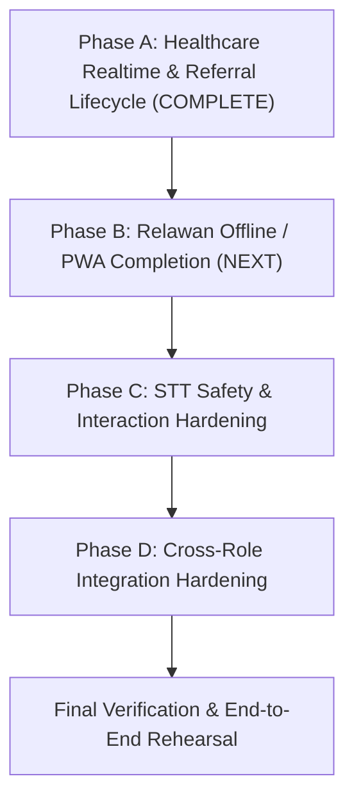

# RAPID-MIND — Technical Architecture & Development Plan

**Project:** RAPID-MIND  
**Document type:** Technical architecture + implementation plan  
**Status:** Working baseline for development  
**Primary source:** `workflow.md`  
**Last updated:** 2026-10-01

---

# Current Demo Sprint Execution Anchor — 1 October 2026

This section defines the **authoritative implementation sequence for the `demo` branch**. It takes precedence over the older broad development-phase ordering (Section 20 below) for day-to-day implementation sequencing. It does NOT replace the permanent architecture, clinical decision-support rules, or UX specifications.

---

## 1. Current Repository Checkpoint

- **Branch:** `demo`
- **Current Repository Checkpoint:** `a699b8c35f87c5e94cad7448e6e1dd05d7981592` (`fix(healthcare): normalize emergency coordinate rendering`)
- **Phase A Main Implementation Checkpoint:** `e778ddfb5f842eab467881f2c15be929290c6a0e` (`feat(healthcare): harden realtime and referral lifecycle`)
- **Prior Healthcare Checkpoint:** `ce38ba6cad97af146a7244d1e8f4835806f14d6e` (`feat(healthcare): complete operational validation and referral workflow`)

### Verification Baseline
- **Laravel Test Suite:** `96 tests passed, 1,137 assertions` (`docker compose exec -T app php artisan test`)
- **Vue TypeScript Check:** `npx vue-tsc --noEmit` PASS (0 errors)
- **Frontend Production Build:** `npm run build` PASS (clean asset manifest, standard large-chunk advisory warning for Map/Analytics assets)
- **Git Formatting / Diff Check:** `git diff --check` PASS (clean, no trailing whitespace or formatting defects)
- **Phase A Status:** **COMPLETE / PASS for the directly testable selected prototype scope** (does not represent full production certification, full production hardening, or user manual sign-off)
- **Healthcare Antigravity Browser Verification:** **PASS** for the directly testable selected prototype scope; preserved NDVs and limited-evidence gates are documented in the Phase A verification matrix below.
- **User Manual Final Retest:** **NOT YET PERFORMED** (pending project owner verification prior to final team demo)

### Preserved Phase A Browser Limitations (Preserved as NDV / Documented Constraints)
- **A1-3 Equal-timestamp ID tie-break:** AUTOMATED-ONLY / NDV in browser (verified oldest-first ordering by distinguishable timestamps in DOM; identical-timestamp ID tie-break is covered by automated feature test suite).
- **A2-4 Duplicate-click protection:** PASS WITH LIMITATION / source-supported (UI disables mutation controls while request is in-flight via `busyId` guard; rapid-double-click race condition not directly reproduced as a browser timing test).
- **A2-6 Stale different mutation:** Backend 409 conflict PASS (direct authenticated browser request verified `expected_status: ACTIVE`, `status: ON_SITE` returned HTTP 409 and preserved canonical state `EN_ROUTE`); Natural visible Inertia conflict UI path NDV (forward-only button filtering structurally prevents user from selecting divergent stale action).
- **A2-7 Exact replay idempotency:** HTTP exact replay PASS in authenticated browser runtime; no-duplicate history invariant automated/database-supported, not browser-visual PASS.
- **Historical NDVs Retained:** Missing-phone T0 fallback (B8), T1-before-T2 priority ordering (C4), Same-category FIFO ordering (C5), Historical referral to inactive Faskes (H).

---

## 2. Completed & Stable Functional Areas

The following areas represent the current implemented functional baseline. Verification depth varies by area; known incomplete capabilities remain explicitly assigned to Phases A–D below. Do not broadly redesign these areas unless the active phase requires a focused integration change or a concrete defect is found:

### Foundation
- Laravel 13 + Vue 3 + Inertia.js + TypeScript application structure.
- PostgreSQL + PostGIS spatial infrastructure in Docker Compose.
- Docker Compose service topology (`app`, `queue`, `scheduler`, `reverb`, `nginx`, `postgres`).
- Role-based session authentication with strict `ADMIN`, `RELAWAN`, and `HEALTHCARE` boundary enforcement.

### Relawan Functional Baseline
- Mobile-first Relawan shell, responsive navigation, and header status.
- Psychological First Aid (PFA) Look, Listen, Link guidebook and 5-4-3-2-1 grounding exercises.
- Patient demographic intake and structured assessment session lifecycle.
- SRQ-20 questionnaire (20 binary items with individual question review).
- 5 weighted vulnerability risk factors (R1–R5).
- 3 daily functioning domains (F1–F3, scored 0/1/3).
- Deterministic system triage recommendation engine with auditable component score breakdown and clinical disclaimer.
- Persistent floating T0 Red Flag emergency shortcut and 3-step confirmation/verification modal.
- Client-side IndexedDB/Dexie schema, draft persistence, outbox abstraction, and sync manager baseline.
- Web Speech API speech-to-text (STT) voice assistance baseline.
*(Note: Offline/PWA sync, local-first T0 outbox persistence, and clinical STT safety hardening are NOT complete and are explicitly addressed in Phases B and C below).*

### Healthcare Functional Baseline
- Emergency-first desktop workspace with T0 queue and incident detail view.
- 2-step T0 acknowledgement and secondary tele-verification logging (Phone, Video, Field Team).
- Clinical classification: T0 confirmation or supported clinical downgrade to T1/T2 with free-text diagnosis notes.
- Reporting Relawan contact on selected T0 incident detail via native `tel:` protocol link (with queue privacy).
- Dedicated Validasi Asesmen worklist with segregated `Perlu Divalidasi` and `Selesai` sections.
- Selected validation review displaying full clinical evidence, score breakdown, prior assessments, and clinical disclaimer.
- Immutable stored clinical validation decisions.
- Explicit active-Faskes selection for new non-T0 clinical referrals (rejection of unselected or inactive destinations).
- Patient longitudinal referral history with distinct provenance: `Sumber: Darurat T0` vs `Sumber: Validasi Asesmen`.
- Multi-stage referral dispatch lifecycle tracking and append-only status history.

### Admin Functional Baseline
- Regional command center summary with macro KPI cards and dynamic operational shelter table.
- Interactive MapLibre GL JS geospatial map with shelter/facility markers and detail popups.
- Longitudinal ECharts analytical charts and 30-day mental health trend lines.
- Dedicated master data management for Posko (Shelters) with PostGIS coordinate pair validation.
- Dedicated master data management for Healthcare Organizations (Faskes) with zero-count accuracy.
- Dedicated account provisioning for Relawan (with required Indonesian phone normalization) and Healthcare users (no role selector).
- Strict active-assignment deactivation guards preventing deactivation of Posko/Faskes with active personnel.
- Reassignment audit logs and retained inactive current assignment edge-case handling.

---

## 3. Remaining Execution Sequence

To complete the end-to-end competition prototype safely without scope creep, remaining work is organized into **four sequential implementation phases (Phases A–D)** followed by a final end-to-end verification sequence.



---

### Phase A — Healthcare Realtime + Referral/Dispatch Completion

#### Status
**COMPLETE / PASS for the directly testable selected prototype scope** (Main Implementation: `e778ddfb5f842eab467881f2c15be929290c6a0e`, Coordinate Correction: `a699b8c35f87c5e94cad7448e6e1dd05d7981592`).
*(Note: Covers the current prototype demonstration scope; does not represent full production certification, full production hardening, or user manual sign-off).*

#### Goal
Harden the realtime emergency reception path and complete the operational referral lifecycle from newly triggered T0 emergency through Healthcare response, verification, and terminal completion without requiring manual page reloads.

#### Implemented & Verified Capabilities

##### 1. Healthcare Realtime Reception Hardening
- **Single Subscription Ownership:** `HealthcareLayout.vue` remains the sole owner of the private `emergencies` Reverb subscription. Redundant page-level subscriptions were avoided, preventing duplicate listeners, race conditions, or multiple audio alerts.
- **Push Without Reload:** Newly triggered T0 emergencies update the open Healthcare emergency queue in real time without requiring manual browser refresh.
- **Duplicate Event Suppression:** Broadcast events are deduplicated in memory using a bounded set of stable emergency IDs (`seenIds` up to 100 entries). Repeated broadcast deliveries of the same emergency ID do not trigger duplicate audio alarms or multiple queue rows.
- **Coalesced Reconciliation:** Realtime-triggered reload requests (`requestReconciliation()`) use in-flight locking (`reloadInFlight` / `reloadRequested`) to prevent overlapping, uncontrolled Inertia requests.
- **Reconnect Server Catch-Up:** WebSocket reconnection automatically triggers authoritative server state reconciliation, pulling in any T0 incidents created during an outage.
- **Finite Audio Notification:** Incoming T0 events play exactly one finite Web Audio tone (~0.3s sine wave at 880 Hz). No continuous, looping, or bouncing alert animations were added.
- **No False Reconnection Alarm:** Reconnection reconciliation does NOT trigger audio alerts; audio is strictly reserved for live incoming emergency pushes.
- **Queue Prioritization:** The pending T0 queue strictly prioritizes the oldest unacknowledged emergencies first (FIFO). Equal-timestamp ordering uses stable internal ID tie-breaking, verified via automated test coverage.
- **Payload & Privacy Protection:**
  - Raw `emergencies` channel is restricted to `HEALTHCARE` only; Admin is intentionally excluded from this patient-level realtime channel.
  - `EmergencyCreated` broadcasts only `{ emergency: { id } }` over WebSockets rather than sensitive patient-level payloads.
  - Queue cards conceal volunteer phone numbers; reporter contact info is revealed only on the selected emergency detail page.
- **Server vs. WebSocket Reachability Distinction:**
  - Independent periodic HTTP probe (`/up` every 15s) decouples application server reachability from WebSocket socket state.
  - Three distinct operational states are communicated:
    1. *Realtime aktif* (both server and WebSocket healthy).
    2. *Realtime terputus* (Reverb down, Laravel HTTP server still reachable; displays *"Pembaruan otomatis sementara tidak tersedia. Data mungkin tidak terbaru. Terakhir diperbarui [time]"*).
    3. *Koneksi ke server terputus* (Laravel HTTP unreachable; takes strict precedence over WebSocket state and displays *"Data di layar mungkin tidak terbaru. Terakhir diperbarui [time]"*).
  - Existing loaded queue data remains visible during outages; pages do not collapse into empty states.
  - Recovery of either Reverb or Laravel automatically restores the healthy indicator and reconciles authoritative data.

##### 2. Referral Operational Lifecycle & Concurrency Integrity
- **Canonical Lifecycle Graph:**
  Enforces the approved operational progression:
  ```text
  ACTIVE
  → EN_ROUTE
  → ON_SITE
     ├→ TRANSPORT → COMPLETED
     └────────────→ COMPLETED
  ```
  Valid edges:
  - `ACTIVE → EN_ROUTE`
  - `EN_ROUTE → ON_SITE`
  - `ON_SITE → TRANSPORT`
  - `ON_SITE → COMPLETED` (optional direct completion without transport)
  - `TRANSPORT → COMPLETED`
  All backward transitions and state skips are rejected. `COMPLETED` is terminal.
- **Centralized Domain Logic:** Progression rules centralized in `App\Enums\ReferralStatus::canTransitionTo()`.
- **Concurrency & Pessimistic Locking:** Database mutations execute within a database transaction with `Referral::whereKey($id)->lockForUpdate()`.
- **Expected-Status Assertion:** Client requests pass `expected_status` alongside target `status`. Stale requests attempting different transitions are rejected with HTTP 409 Conflict without overwriting canonical state.
- **Idempotent Replay Support:** Exact replay requests (`expected_status` matching prior state, target `status` already applied) return HTTP 200 without duplicating history rows.
- **Immutable Status History:** Every accepted status mutation transactionally appends exactly one record to `referral_status_histories`.
- **Forward-Only UI Controls:** The interface renders only legitimate next action buttons for the current state (`nextReferralActions()`), blocking illegal transitions at the UI layer.
- **Terminal Confirmation:** Transitioning to `COMPLETED` requires concise explicit confirmation via a confirmation dialog.
- **Neutral Operational Terminology:** Uses approved neutral Indonesian labels:
  - `Aktif`
  - `Menuju lokasi`
  - `Tiba di lokasi`
  - `Transportasi`
  - `Selesai`
  *(Misleading legacy terminology such as "Ambulans Menuju Posko", "Tiba di Posko", "Selesai di RS", and "Diterima RS" has been eliminated).*

##### 3. Architectural Caveat: Combined Referral Progression vs. Future Dispatch Domain
- **Explicit Domain Scope:** The current Phase A implementation hardens the existing combined prototype referral/operational progression within the `Referral` model and `ReferralStatus` enum.
- **No Separate Dispatch Domain Claimed:** Phase A does NOT introduce an independent `EmergencyDispatch` model, dedicated ambulance/vehicle registry, fleet management, response-team entity, or dispatch-team CRUD. The dedicated UX specifications still conceptually distinguish Referral from Dispatch/response team. The prototype currently unites these concepts in a hardened operational lifecycle.

##### 4. Coordinate Rendering Corrective Fix & Retest
- **Runtime Defect Discovered:** During the initial Phase A browser verification run on demo-seeded incident `81b5391a-9632-528b-a211-12a907125561` ("Bambang Sudarmono"), non-null decimal coordinates caused a client-side exception: `TypeError: latitude.toFixed is not a function`.
- **Root Cause:** Laravel's `decimal:8` model attribute casts serialize coordinates as string primitives in Inertia JSON payloads, while the component invoked `.toFixed()` directly.
- **Corrective Commit:** `a699b8c35f87c5e94cad7448e6e1dd05d7981592` (`fix(healthcare): normalize emergency coordinate rendering`).
- **Correction Details:** `resources/js/Pages/Healthcare/Emergencies/Show.vue` introduces `parseCoordinate()` and `formatCoordinates()` to safely normalize numbers/strings to finite numbers, format with 4 decimal places, and provide a clean fallback (`"Sesuai Posko"`) for missing or non-finite values.
- **Corrective Browser Retest Results:**
  - Decimal-string coordinate rendering (`-7.6892, 110.4234`) — `PASS`
  - Missing/null coordinate fallback (`Sesuai Posko`) — `PASS`
  - Normal emergency detail regression — `PASS`
  - Healthcare emergency queue smoke — `PASS`
  - Healthcare referral worklist smoke — `PASS`
  - Runtime / console errors: `0`

##### 5. Phase A Browser Verification Matrix Summary

| Gate | Description | Browser Verification Status | Evidence / Notes |
| :--- | :--- | :--- | :--- |
| **A1-1** | Initial Healthy Realtime State | **PASS** | "Realtime aktif", 0 warnings, queue loaded, private auth 200 OK |
| **A1-2** | Realtime T0 Push Delivery | **PASS** | Auto-delivery without reload, pending count 2→3, finite audio (1 tone), no focus stealing |
| **A1-3** | Queue FIFO Priority Ordering | **PASS** | Oldest unacknowledged T0 rendered first; ID tie-break automated-only / NDV in browser |
| **A1-4** | Queue vs Detail Contact Privacy | **PASS** | Queue conceals phone number; detail page exposes volunteer name, phone, and `tel:` action |
| **A1-5** | Reverb-Only Outage State | **PASS** | Reverb stopped: shows "Realtime terputus" + stale notice; "Koneksi ke server terputus" absent; data preserved |
| **A1-6** | T0 Persists During Reverb Outage | **PASS** | Emergency saved to DB; Relawan shows fallback warning; Healthcare does not receive event while down |
| **A1-7** | Reconnection Catch-Up | **PASS** | Reverb restarted: returns to "Realtime aktif", missed T0 reconciled into queue (count 3→4), 0 audio calls |
| **A1-8** | Duplicate Event Suppression | **PASS** | Immediate duplicate broadcast rejected by `seenIds`; audio alert sounded exactly once; single DOM card |
| **A1-9** | Server Unreachable Precedence | **PASS** | App container stopped: `/up` probe fails, "Koneksi ke server terputus" takes precedence over open WebSocket |
| **A1-10**| Server Recovery & Resumption | **PASS** | App container restarted: `/up` probe recovers, queue reconciles, returns cleanly to "Realtime aktif" |
| **A2-1** | Valid Next Action: ACTIVE | **PASS** | Only "Mulai menuju lokasi" displayed; subsequent buttons strictly hidden |
| **A2-2** | Progression: EN_ROUTE → ON_SITE | **PASS** | Transition succeeds without page reload; status updates to "Tiba di lokasi" |
| **A2-3A**| Transport Progression Branch | **PASS** | ON_SITE exposes both actions; ON_SITE → TRANSPORT → Selesaikan; confirmation modal confirmed; terminal state |
| **A2-3B**| Non-Transport Direct Completion | **PASS** | ON_SITE → Selesaikan directly; confirmation modal confirmed; terminal state without transport required |
| **A2-4** | Duplicate-Click Protection | **PASS WITH LIMITATION** | Source-supported via `busyId` button disablement; timing race not directly browser reproduced |
| **A2-5** | Dual-Browser Canonical Update | **PASS** | Browser A advances ACTIVE → EN_ROUTE; Browser B retains stale view |
| **A2-6** | Stale Different Mutation | **PASS (Backend) / NDV (UI)**| Authenticated POST rejected with HTTP 409 Conflict; natural visible UI conflict NDV due to forward-only gating |
| **A2-7** | Exact Replay Idempotency | **PASS (HTTP) / automated + database-supported** | Authenticated browser-runtime replay returns HTTP 200; no-duplicate history invariant is covered by automated tests and database inspection, not browser-visual verification |
| **Sec 9** | Neutral Operational Wording | **PASS** | Rendered labels verified: Aktif, Menuju lokasi, Tiba di lokasi, Transportasi, Selesai; legacy terms absent |
| **Sec 14** | Referral Provenance & History | **PASS WITH LIMITATION** | Browser directly verified assessment-validation provenance and the rendered status-history trail; distinct T0-vs-assessment provenance and append-only integrity remain additionally covered by source/automated tests |
---

### Phase B — Relawan Offline/PWA Completion

#### Goal
Finish the required field-operational local-first behavior for frontline volunteers using the existing Dexie/IndexedDB outbox architecture.

#### Existing Foundation
- `resources/js/offline/db.ts` (IndexedDB schema via Dexie).
- `resources/js/offline/assessmentDraft.ts` (local draft persistence).
- `resources/js/offline/syncManager.ts` (outbox queue and synchronization manager).
- Data workspace (`/relawan/data`) with server-backed in-progress assessments, completed assessments, and a manual `Sinkronkan` action through `syncManager`.

#### Current Gaps to Address
- Relawan shell header does not dynamically reflect real sync-manager queue counts.
- T0 emergency creation is not fully local-first (must be guaranteed persisted locally before server sync).
- Priority-capable outbox infrastructure already exists and sorts lower numeric priority first, but the T0 submission flow is not currently wired through the local-first emergency outbox path. Therefore emergency priority exists as infrastructure but is not yet exercised by actual T0 creation (assessment server mutations also need source inspection during Phase B before claiming complete outbox integration).
- A production PWA/service-worker offline shell is not currently configured in Vite. Phase B must determine and implement the minimum approved PWA/offline-shell solution required by the final handoff, then verify it directly.

#### Required Implementation
1. **Local-First T0 & Assessment Persistence:**
   - T0 emergency submission must persist locally to IndexedDB before server transmission is attempted.
   - Routine assessment sessions must save complete responses locally to outbox, with source inspection of assessment server mutations to ensure full outbox coverage.
   - Interrupted assessments must support deterministic recovery on page reload or device restart.
   - Client-generated UUIDs ensure idempotency and prevent duplicate records upon server replay.
2. **Prioritized Outbox Synchronization:**
   - Wire actual T0 creation through the local-first emergency outbox path to exercise existing priority queueing (priority 1 emergencies synchronized before priority 2 routine assessments).
   - Distinct, explicit status states: `Local Saved` ≠ `Syncing` ≠ `Server Confirmed`.
   - Never display "Tersinkron" when records remain in local outbox.
3. **UI & Shell Integration:**
   - Relawan layout header consumes real sync-manager state (`Tersinkron` vs `Pending Sync (N)` vs `Offline`).
   - Extend `/relawan/data` so it truthfully exposes local pending records, actual outbox counts/items where appropriate, and synchronization state (do not claim an outbox listing exists before it is implemented).
   - Native SMS fallback remains available as a manual device handoff only; do not invent automated SMS background sending.
   - Do NOT claim fresh-login offline authentication unless an explicit local credentials cache is implemented and verified.
4. **PWA Offline Shell:**
   - Determine and implement the minimum approved PWA/service-worker solution in Vite.
   - Verify Service Worker registers and caches essential PWA app shell assets for offline startup.
   - Offline form interactions must survive browser reload/restart without data loss.

#### Verification Gate
- **Actual Browser Offline Test:**
  - Online → switch network to Offline in DevTools.
  - Create/edit assessment and create T0 emergency.
  - Reload browser while offline: verify data survives.
  - Switch network to Online → trigger sync.
  - Verify authoritative server records created without duplicates.
  - Confirm T0 emergency is synchronized ahead of normal assessments.

---

### Phase C — STT Safety & Interaction Hardening

#### Goal
Retain Web Speech API speech-to-text as an assistive frontline accelerator while strictly enforcing the clinical-safety decision-support contract.

#### Existing Foundation
- `resources/js/Pages/Relawan/Assessment/Srq.vue` integrates browser Web Speech API (`webkitSpeechRecognition` / `SpeechRecognition`) with `continuous = true`, `interimResults = true`, `lang = 'id-ID'`.
- Indonesian keyword dictionary matching positive symptom indicators.

#### Current Gaps to Address
- Current keyword matcher can directly mutate SRQ answers to `true` without explicit volunteer review.
- Spoken indications of suicide/danger (Q17) must not autonomously finalize answers or trigger T0 without volunteer agency.

#### Required Implementation
1. **Assistive Separation & Explicit Review:**
   - Realtime transcript and keyword detection must remain visual suggestions/hints; they must NEVER silently mutate confirmed SRQ answers.
   - Confirmed SRQ radio buttons (`YA` / `TIDAK`) remain strictly under manual volunteer control.
   - Manual Relawan selection is always authoritative over STT suggestions.
   - Uncertain or ambiguous STT interpretations must be visibly flagged as tentative suggestions.
2. **Q17 & Emergency Safety Contract:**
   - Spoken danger or suicidal ideation (Q17) detected by STT must present a prominent safety warning and offer a shortcut to the T0 Red Flag workflow.
   - STT must NEVER autonomously set Q17 to `YA`, finalize an assessment, or dispatch an emergency event on its own.
3. **Robustness & Degradation:**
   - Explicit listening state indicators (Idle vs Listening vs Processing).
   - Avoid permanent pulsing animations outside active microphone capture.
   - Safe degradation for unsupported browsers: hide or disable microphone button with clear explanation; manual form completion must remain 100% functional.
   - Recognition errors (network, permission denied, no speech) must show transient non-blocking alerts and never prevent manual completion.
   - Preserve local answer drafts regardless of STT state.
   - Do not introduce external third-party STT cloud APIs without explicit approval.

#### Verification Gate
- **Browser Verbal & Manual Tests:**
  - Verify spoken "Ya" produces suggestion without silently overwriting confirmed "Tidak".
  - Verify manual click overrides STT suggestion.
  - Verify Q17 spoken danger produces safety prompt without autonomous T0 dispatch.
  - Simulate microphone error / unsupported API and verify manual completion succeeds.

---

### Phase D — Cross-Role Integration Hardening

#### Goal
Execute targeted integration and stability hardening across all three role experiences, resolving edge cases rather than adding new features.

#### Key Areas to Harden
1. **Idempotency & Replay:** Verify duplicate POST submissions for assessments, T0 emergencies, clinical validations, and referrals are rejected or safely deduplicated by stable IDs.
2. **Lifecycle State Integrity:** Prevent illegal transitions (e.g. validating an incomplete assessment, confirming an already downgraded emergency, or dispatching a completed referral).
3. **Concurrency & Realtime Resilience:** Verify graceful behavior during concurrent triage reviews, stale WebSocket sessions, and rapid role switching.
4. **Form Factor & Responsive Usability:** Verify Relawan PWA displays cleanly on mobile viewports (390px width); verify Healthcare and Admin cockpits display cleanly on desktop viewports (1280px+).
5. **Accessibility & Usability:** Basic keyboard navigation, visible focus indicators, valid form labels, and appropriate contrast across operational states.
6. **Error & Empty States:** Verify clear Indonesian messaging for empty worklists, network dropouts, and invalid deep links.
7. **No Scope Creep:** Do not turn this phase into a broad architecture refactor or full visual redesign.

---

## 4. Final Verification Sequence

Once Phases A through D are completed, the final verification sequence will be executed in this exact order:

```text
Phase A — COMPLETE / PASS for selected prototype scope
↓
Phase B — Relawan Offline / PWA Completion (NEXT)
↓
Phase C — STT Safety & Interaction Hardening
↓
Phase D — Cross-Role Integration Hardening
↓
Final Antigravity end-to-end rehearsal
↓
Project-owner manual final retest
```

### Final Cross-Role Golden Demo Path:
```text
1. Login as Relawan
2. PFA reference & review
3. Patient demographic intake
4. Structured SRQ-20 assessment (with assistive STT)
5. Vulnerability risk factor checklist
6. Daily functioning evaluation
7. System triage recommendation generation (T1 / T2)
8. Emergency escalation: T0-Suspect creation via Red Flag shortcut
9. Realtime broadcast: Server dispatches EmergencyCreated over Reverb
10. Healthcare reception: Open emergency queue receives T0 without reload
11. Healthcare response: Review volunteer contact (tel:), 2-step acknowledgement, secondary tele-verification
12. Healthcare classification: T0 clinical confirmation or supported downgrade
13. Referral progression: Active facility dispatch tracking and status progression
14. Healthcare validation: Validasi worklist review of completed assessment, clinical decision, referral creation
15. Patient longitudinal profile: Verification of dual-provenance referral history (Darurat T0 vs Validasi Asesmen)
16. Admin visibility: Regional Command Center aggregates live KPIs, geospatial map, and longitudinal analytics
```

---

## 5. Scope Guardrails & Non-Negotiable Rules

All remaining implementation work must adhere strictly to these principles:
- **No Broad Redesigns:** Do not reopen completed Admin, Healthcare, or Relawan screens for aesthetic or architectural overhaul during Phases A–D.
- **Clinical Safety Boundaries:** System triage is a decision recommendation (*"Rekomendasi Sistem"*), NOT a medical diagnosis. Never represent automated scores as diagnoses.
- **No Diagnostic Taxonomy Invention:** Do not invent clinical thresholds, Red Flag rules, scoring formulas, or psychiatric diagnostic categories not supported by existing project sources.
- **Technology Preservation:** Do not replace Laravel Reverb + Echo with Pusher or external services. Do not replace Dexie + IndexedDB. Do not introduce Redis or external databases unless mandated.
- **Status Truthfulness:** Never claim "Tersinkron" when data is only saved locally. Never claim realtime delivery when WebSockets are disconnected. Never claim phone calls connected when only a `tel:` URI was rendered.
- **Git Rules:** The user performs all Git mutations. Never run `git add`, `git commit`, `git push`, `git checkout`, or any mutating Git command.
- **Dependency Rules:** Do not install dependencies without explicit user instruction. All PHP dependencies must run inside Docker; frontend dependencies run on the host.

---

## 6. Decision Rule for Remaining Tasks

Before starting any task in the remaining demo sprint:
1. **Read this Current Demo Sprint Execution Anchor.**
2. **Inspect the current `demo` branch codebase.**
3. **Read the applicable dedicated UX specification.**
4. **Confirm the requested task belongs to the active phase (Phase B, C, or D; Phase A is complete).**
5. **Implement the smallest coherent, working slice.**
6. **Run automated verification (`docker compose exec -T app php artisan test`, frontend build/lint).**
7. **Perform focused browser verification where required.**
8. **Update verification documentation only after concrete runtime evidence exists.**

If an issue belongs to a later phase and does not block the active phase, record it in documentation rather than expanding scope.

---

## 1. Project Goal

RAPID-MIND is an offline-capable disaster mental-health response platform with three operational roles:

1. **Relawan / Frontline Volunteer**
   - Mobile-first PWA.
   - PFA guide for Day 1–3.
   - SRQ-20 + Risk Factors + Functional Assessment for Day 4–30.
   - Persistent T0 Red Flag emergency shortcut.
   - Offline-first assessment capture and later synchronization.

2. **Healthcare / Faskes / PSC 119**
   - Desktop-oriented operational dashboard.
   - Receives T0-Suspect alerts.
   - Performs secondary/clinical validation.
   - Manages referral and priority queues.
   - Reviews patient assessment history.

3. **Admin / BPBD / Dinkes**
   - Desktop-oriented command-center dashboard.
   - Geospatial monitoring and heatmaps.
   - Aggregate regional analytics.
   - 30-day longitudinal monitoring.
   - Volunteer/resource/logistics management.

The system is a **decision-support platform**, not an autonomous diagnostic system. Triage outputs remain recommendations until validated by qualified healthcare personnel.

---

# 2. Final Technology Direction

## 2.1 Core Stack

| Area | Technology |
|---|---|
| Main framework | Laravel 13 |
| Backend language | PHP |
| Frontend | Vue 3 |
| Frontend bridge | Inertia.js |
| Frontend language | TypeScript |
| Styling | Tailwind CSS |
| UI components | shadcn-vue or equivalent reusable component system |
| Build tool | Vite |
| Authentication | JWT access token + refresh token |
| Authorization | Laravel Middleware + Policies/Gates |
| Database | PostgreSQL |
| Geospatial extension | PostGIS |
| ORM | Eloquent |
| Realtime | Laravel Reverb + Laravel Echo |
| Background jobs | Laravel Queue |
| Scheduled jobs | Laravel Scheduler |
| Offline local database | IndexedDB |
| IndexedDB wrapper | Dexie.js |
| PWA / Service Worker | Workbox / Vite PWA integration |
| Map | MapLibre GL JS |
| Charts | ECharts |
| Backend tests | Pest / PHPUnit |
| Browser/E2E tests | Playwright |
| Reverse proxy | Nginx |
| Infrastructure | Docker + Docker Compose |

---

## 2.2 Architecture Principle

RAPID-MIND will be developed as:

> **One product, one repository, one Laravel application, one user-facing website, three role-specific experiences.**

It should **not** become three separate websites unless future scale or organizational ownership makes that necessary.

The three roles will have separate layouts, routes, permissions, and workflows inside one Laravel + Vue/Inertia application.

Example URL structure:

```text
/login

/relawan/*
/healthcare/*
/admin/*
```

Role-specific routes:

```text
/relawan/dashboard
/relawan/pfa
/relawan/patients
/relawan/assessment
/relawan/history
/relawan/emergency

/healthcare/dashboard
/healthcare/emergency
/healthcare/patients
/healthcare/referrals
/healthcare/validation

/admin/dashboard
/admin/map
/admin/analytics
/admin/volunteers
/admin/logistics
```

---

# 3. High-Level System Architecture

```text
                         ┌─────────────────────┐
                         │       NGINX         │
                         │   Public Gateway    │
                         └──────────┬──────────┘
                                    │
                                    ▼
                         ┌─────────────────────┐
                         │      Laravel        │
                         │ PHP-FPM + Inertia   │
                         └──────────┬──────────┘
                                    │
               ┌────────────────────┼────────────────────┐
               │                    │                    │
               ▼                    ▼                    ▼
       ┌──────────────┐     ┌──────────────┐     ┌──────────────┐
       │ Queue Worker │     │   Reverb     │     │  Scheduler   │
       │              │     │  WebSocket   │     │              │
       └──────┬───────┘     └──────┬───────┘     └──────┬───────┘
              │                    │                    │
              └────────────────────┼────────────────────┘
                                   │
                                   ▼
                      ┌────────────────────────┐
                      │ PostgreSQL + PostGIS   │
                      └────────────────────────┘
```

The browser side additionally contains:

```text
Vue 3
├── Inertia pages
├── TypeScript domain helpers
├── Service Worker
├── IndexedDB / Dexie
├── offline outbox
├── local assessment state
├── MapLibre
└── Laravel Echo client
```

---

# 4. Docker Strategy

Docker Compose is the canonical way to run RAPID-MIND.

The target developer experience should be approximately:

```bash
git clone <repository>
cd rapid-mind

cp .env.example .env

docker compose up -d --build
```

The team should not need to install PostgreSQL, PHP, Nginx, or other infrastructure manually on the host machine.

## 4.1 Main Containers

Recommended services:

```text
nginx
app
queue
reverb
scheduler
postgres
```

Optional later:

```text
redis
```

Redis should only be introduced when there is a concrete need such as:

- high-volume queue processing;
- Bull/Redis-style queue semantics;
- multiple Laravel application replicas;
- distributed realtime state;
- advanced rate limiting;
- larger-scale caching.

Do not add Redis in the initial implementation simply because it is common in Laravel stacks.

---

## 4.2 Same Image, Different Laravel Processes

The following containers can use the same Laravel application image:

```text
app
queue
reverb
scheduler
```

with different commands.

Conceptual example:

```yaml
app:
  build: .

queue:
  build: .
  command: php artisan queue:work

reverb:
  build: .
  command: php artisan reverb:start

scheduler:
  build: .
  command: php artisan schedule:work
```

---

## 4.3 Compose Files

Recommended layout:

```text
compose.yaml
compose.dev.yaml
compose.prod.yaml
```

### Development

Development configuration may include:

- source bind mounts;
- Vite dev server;
- hot module reload;
- debug logging;
- local development database;
- development-only ports.

### Production

Production configuration should include:

- built frontend assets;
- Nginx public entry point;
- compiled Laravel dependencies;
- persistent PostgreSQL volume;
- health checks;
- restart policies;
- no unnecessary public database ports;
- secret/environment handling;
- backups.

---

# 5. Repository Structure

Recommended initial structure:

```text
rapid-mind/
│
├── app/
│   ├── Domain/
│   │   ├── Assessment/
│   │   ├── Triage/
│   │   ├── Emergency/
│   │   ├── Patient/
│   │   └── Referral/
│   │
│   ├── Http/
│   │   ├── Controllers/
│   │   ├── Middleware/
│   │   └── Requests/
│   │
│   ├── Models/
│   ├── Policies/
│   ├── Events/
│   ├── Listeners/
│   ├── Jobs/
│   └── Services/
│
├── bootstrap/
├── config/
├── database/
│   ├── migrations/
│   ├── seeders/
│   └── factories/
│
├── resources/
│   ├── js/
│   │   ├── pages/
│   │   │   ├── Auth/
│   │   │   ├── Relawan/
│   │   │   ├── Healthcare/
│   │   │   └── Admin/
│   │   │
│   │   ├── components/
│   │   ├── layouts/
│   │   ├── composables/
│   │   ├── offline/
│   │   ├── services/
│   │   ├── stores/
│   │   └── domain/
│   │
│   └── css/
│
├── routes/
│   ├── web.php
│   ├── api.php
│   └── channels.php
│
├── tests/
│   ├── Feature/
│   └── Unit/
│
├── nginx/
├── docker/
│
├── compose.yaml
├── compose.dev.yaml
├── compose.prod.yaml
├── Dockerfile
├── .env.example
├── composer.json
├── package.json
└── README.md
```

---

# 6. Authentication Architecture

RAPID-MIND will use JWT instead of Laravel's default session-based authentication.

## 6.1 Token Model

Use two token classes:

### Access Token

- Short-lived.
- Used in authenticated API requests.
- Recommended starting lifetime: approximately 15 minutes.

### Refresh Token

- Longer-lived.
- Used only to obtain a new access token.
- Recommended starting lifetime: approximately 7–30 days.
- Must use rotation.

Conceptual flow:

```text
POST /api/auth/login
        │
        ├── Access JWT
        └── Refresh JWT
```

Normal API request:

```text
Authorization: Bearer <access-token>
```

Refresh flow:

```text
Expired access token
        │
        ▼
POST /api/auth/refresh
        │
        ▼
Validate refresh token
        │
        ▼
Rotate refresh token
        │
        ├── new access token
        └── new refresh token
```

---

## 6.2 JWT Claims

JWT payload should remain minimal.

Example:

```json
{
  "sub": "user-uuid",
  "role": "RELAWAN",
  "jti": "token-uuid",
  "ver": 1,
  "iat": 1790672400,
  "exp": 1790673300,
  "iss": "rapid-mind",
  "aud": "rapid-mind-web"
}
```

Never store the following inside JWT payloads:

- NIK;
- SRQ answers;
- patient clinical history;
- GPS history;
- diagnosis;
- assessment records;
- sensitive emergency information.

JWTs are signed, not automatically encrypted.

---

## 6.3 Token Storage

Preferred approach:

```text
Access JWT
→ browser memory
→ Authorization header

Refresh JWT
→ Secure + HttpOnly + SameSite cookie
```

Do not intentionally persist long-lived authentication tokens in:

```text
localStorage
IndexedDB
```

Offline assessment data and authentication credentials must be treated separately.

---

## 6.4 Revocation

Add revocation support through:

```text
token_version
jti
user active status
```

Example user fields:

```text
id
name
email
password
role
token_version
is_active
```

When security-sensitive events occur, increment `token_version`.

Typical triggers:

- password reset;
- lost volunteer device;
- role changed;
- user disabled;
- suspected compromise;
- force logout on all devices.

---

# 7. RBAC

Initial roles:

```text
RELAWAN
HEALTHCARE
ADMIN
```

Initial user table may use a simple role field.

Do not create a complex permission matrix until granular roles are actually needed.

Later possible expansion:

```text
Doctor
Psychiatrist
Nurse
PSC Operator
BPBD Admin
Dinkes Admin
Super Admin
```

At that stage the application may move to role/permission tables or a package such as `spatie/laravel-permission`.

---

## 7.1 Frontend Authorization

Frontend role checks are used for:

- routing;
- navigation;
- visible actions;
- role-specific layouts;
- UX.

Example:

```text
RELAWAN
→ /relawan

HEALTHCARE
→ /healthcare

ADMIN
→ /admin
```

---

## 7.2 Backend Authorization

Backend authorization is the real security boundary.

Every sensitive route must independently enforce the user's permission.

Conceptual example:

```php
Route::middleware([
    'auth.jwt',
    'role:healthcare'
])->group(function () {
    // healthcare-only endpoints
});
```

A user manually entering an Admin or Healthcare URL must not gain access to the underlying data.

---

# 8. Offline-First Architecture

The Relawan interface must remain operational when the server is unavailable.

The main write path should be:

```text
UI
 ↓
IndexedDB
 ↓
local outbox
 ↓
sync process
 ↓
Laravel API
 ↓
PostgreSQL
```

Not:

```text
UI
 ↓
Laravel API
 ↓
Database
```

The local device is responsible for safely preserving unsynchronized work.

---

## 8.1 Offline-Capable Features

The following should work without an internet connection:

- PFA guide;
- patient lookup from locally cached records where available;
- new local patient record;
- SRQ-20 form;
- risk-factor assessment;
- function assessment;
- local triage calculation;
- T0 local handling;
- saving assessments;
- viewing unsynchronized items;
- synchronization status.

Features requiring the server can show unavailable/offline states instead of breaking the workflow.

---

## 8.2 Local IndexedDB Stores

Initial local stores may include:

```text
patients
assessments
srq_responses
risk_responses
function_responses
emergency_events
outbox
sync_metadata
```

Sensitive offline records should eventually be protected with appropriate local encryption/key handling.

---

## 8.3 Sync Triggers

Do not rely only on Background Sync API.

Trigger synchronization through multiple paths:

```text
submit
→ immediate sync attempt

network restored
→ sync attempt

app resume
→ sync attempt

app startup
→ sync attempt

background sync
→ when supported
```

---

## 8.4 Conflict Handling

Every offline-created object should use stable identifiers.

Recommended approach:

```text
UUID generated client-side
created_at_client
updated_at_client
synced_at
server_version
```

Do not rely only on NIK as the database identity.

NIK can be a patient identifier, but system records should have UUID primary keys.

Conflict strategy should be explicitly defined by entity.

Examples:

- immutable assessment submission → append new version;
- patient demographic correction → version-aware update;
- T0 event → append-only event history;
- clinical validation → new validation record, not overwrite of original event.

---

# 9. Offline Authentication Behavior

JWT expiry must not destroy field work.

Example condition:

```text
12:00 login
12:15 access token expires
12:10 internet is lost
12:30 volunteer continues assessment
```

Expected behavior:

```text
Authenticated while online
        │
        ▼
device loses network
        │
        ▼
offline field mode
        │
        ├── PFA remains available
        ├── assessment remains available
        ├── triage works locally
        ├── IndexedDB continues working
        └── synchronization waits
```

When network returns:

```text
network restored
        │
        ▼
try token refresh
        │
        ├── success
        │     ↓
        │   sync outbox
        │
        └── failure
              ↓
           require login
              ↓
        preserve unsynced data
```

A failed login or expired JWT must **never delete unsynchronized assessments**.

---

# 10. Triage Engine

The triage logic must be isolated from controllers and UI components.

Recommended backend structure:

```text
app/Domain/Triage/
├── TriageCalculator.php
├── SrqCalculator.php
├── RiskCalculator.php
├── FunctionCalculator.php
├── RedFlagDetector.php
└── TriageResult.php
```

The current workflow defines:

```text
SRQ-20          0–20
Risk Factor     0–8
Function        0–9
---------------------
Total           0–37
```

Triage:

```text
T3 = 0–6
T2 = 7–14
T1 = >= 15
     OR severe functional impairment condition
```

T0 does not belong to the normal score threshold.

T0 is an override/emergency state.

---

# 11. Dual Triage Calculation

Because Relawan must work offline, triage logic must exist in two places.

## Client

TypeScript implementation:

```text
resources/js/domain/triage/
```

Used for:

- offline calculation;
- instant result display;
- local T0 behavior.

## Server

PHP implementation:

```text
app/Domain/Triage/
```

Used as canonical authority.

Synchronization flow:

```text
offline assessment
        ↓
client calculates triage
        ↓
result shown to volunteer
        ↓
record synchronized
        ↓
Laravel recalculates
        ↓
canonical result stored
```

The server must never trust a client-provided score without recalculating it.

Automated tests must ensure PHP and TypeScript implementations return identical expected outputs for the same fixtures.

---

# 12. T0 Emergency Architecture

T0 must be treated as an emergency event, not merely a high score.

Conceptual state:

```text
Normal Assessment
    ↓
T1 / T2 / T3

Emergency Trigger
    ↓
T0-SUSPECT
    ↓
Healthcare Validation
    ↓
T0-CONFIRMED
or
downgraded to T1/T2
```

---

## 12.1 T0 Trigger Sources

T0 may be triggered through:

- SRQ-20 item #17 according to the configured safety rule;
- persistent Red Flag button;
- other configured emergency indicators.

The final clinical/emergency trigger rules must remain explicit and testable.

---

## 12.2 T0 Event Flow

Online:

```text
Volunteer
   │
   ▼
T0 Trigger
   │
   ▼
Verification Gate
   │
   ▼
Create T0-Suspect Event
   │
   ▼
Laravel API
   │
   ├── PostgreSQL
   │
   ├── Queue
   │
   └── Reverb
           │
           ▼
Healthcare Dashboard
```

Offline:

```text
Volunteer
   │
   ▼
T0 Trigger
   │
   ▼
Local Emergency Event
   │
   ├── visual/audio/vibration guidance
   ├── priority IndexedDB record
   └── high-priority outbox
```

When connectivity returns:

```text
Priority T0 event
   ↓
sync before normal queued records
   ↓
Laravel API
   ↓
Healthcare realtime alert
```

---

# 13. SMS / GSM Fallback

Do not assume that a pure PWA can silently send an SMS.

The desired fallback concept is:

```text
Tier 1
Internet available
→ Laravel API + Reverb

Tier 2
Internet unavailable but GSM/SMS available
→ native-assisted SMS flow

Tier 3
Fully offline
→ priority local queue + physical instructions
```

For the initial website/PWA prototype:

- implement Tier 1;
- implement Tier 3;
- represent Tier 2 through a safe native handoff or prototype abstraction.

If guaranteed automatic SMS is later required, add a native Android wrapper such as Capacitor or a dedicated field application.

Do not claim browser capabilities that cannot be guaranteed.

---

# 14. Realtime Architecture

Use:

```text
Laravel Reverb
+
Laravel Echo
```

for live events.

Potential private channels:

```text
private-healthcare.facility.{facilityId}
private-admin.region.{regionId}
private-volunteer.{userId}
```

Example event flow:

```text
T0-Suspect created
      │
      ▼
Laravel Event
      │
      ▼
Queue / Broadcast
      │
      ▼
Reverb
      │
      ▼
authorized Healthcare users
```

Admin users may receive aggregated operational events, while Healthcare receives patient-specific operational alerts according to authorization rules.

---

# 15. Initial Database Direction

The exact schema will be designed separately, but the first domain model should include the following areas.

## Identity / Access

```text
users
refresh_tokens
user_sessions / token registry (if required)
```

## Organization / Location

```text
regions
shelters
healthcare_facilities
```

## Volunteer Operations

```text
volunteers
volunteer_assignments
volunteer_locations
```

## Patient

```text
patients
patient_identifiers
patient_contacts
```

## Assessment

```text
assessments
srq_responses
risk_assessments
risk_responses
function_assessments
function_responses
triage_results
```

## Emergency

```text
emergency_events
emergency_verifications
emergency_dispatches
```

## Clinical

```text
clinical_validations
clinical_notes
referrals
referral_status_history
```

## Logistics

```text
resource_types
resource_requests
resource_allocations
```

## System

```text
audit_logs
sync_events
```

---

# 16. Important Data Modeling Rules

## 16.1 Do Not Overwrite System Recommendation

Example:

```text
system_recommendation = T0_SUSPECT
clinical_validation    = T1
```

Store them separately.

The original recommendation is part of the audit history.

---

## 16.2 T0 Event Is Separate From Assessment

`emergency_events` must not simply be another field inside the assessment record.

T0 can occur:

- during PFA;
- before SRQ completion;
- during assessment;
- independently from the normal score engine.

---

## 16.3 Use UUIDs

Use UUIDs for major system entities.

Examples:

```text
user_id
patient_id
assessment_id
emergency_event_id
referral_id
facility_id
shelter_id
```

NIK is a patient identifier, not the universal primary key.

---

## 16.4 Auditability

Important transitions should be append-only or logged.

Examples:

```text
T0-Suspect created
T0 reviewed
T0 confirmed
T0 downgraded
ambulance requested
ambulance dispatched
patient arrived
referral completed
```

Store:

```text
actor
timestamp
previous state
new state
reason
metadata
```

---

# 17. Security Baseline

RAPID-MIND handles highly sensitive data.

Initial security requirements:

- HTTPS in deployment;
- password hashing using Laravel-supported secure defaults;
- JWT access tokens with short expiration;
- refresh-token rotation;
- refresh-token revocation;
- HttpOnly/Secure refresh cookie;
- no sensitive clinical information in JWT;
- backend-enforced RBAC;
- private Reverb channels;
- database not publicly exposed;
- audit logs for clinical/emergency actions;
- secure secret storage;
- no secrets committed to Git;
- validation for every API request;
- rate limiting on login and sensitive endpoints;
- explicit CORS configuration if required;
- CSP/XSS mitigation strategy;
- regular backups.

Offline IndexedDB security requires a separate implementation review because the browser must retain sensitive data in field conditions.

---

# 18. Backup and Database Operations

Docker volume persistence is not a backup strategy.

Production must eventually include:

```text
persistent PostgreSQL volume
+
scheduled pg_dump
+
off-host backup destination
+
restore procedure
+
migration procedure
```

The team must test restore operations, not only backup creation.

---

# 19. Testing Strategy

## 19.1 Unit Tests

Highest-priority unit tests:

- SRQ score calculation;
- risk score calculation;
- function score calculation;
- T1/T2/T3 thresholds;
- functional override;
- T0 override;
- client/server fixture parity;
- JWT validation;
- role middleware;
- emergency state transitions.

---

## 19.2 Feature Tests

Test:

- login;
- token refresh;
- logout;
- forced token revocation;
- Relawan endpoint restrictions;
- Healthcare endpoint restrictions;
- Admin endpoint restrictions;
- patient creation;
- assessment submission;
- T0 creation;
- clinical validation;
- referral transitions.

---

## 19.3 E2E Tests

Playwright should cover critical user journeys.

### Relawan

```text
login
→ PFA
→ patient
→ assessment
→ triage result
→ offline save
→ reconnect
→ sync
```

### Emergency

```text
Relawan login
→ T0 trigger
→ verification
→ Healthcare receives alert
→ Healthcare validates
→ status updated
```

### Admin

```text
Admin login
→ dashboard
→ map
→ filter region
→ inspect shelter
→ view aggregate trend
```

---

# 20. Development Phases

> The phase structure below remains the architectural/historical development plan. For the current `demo` sprint execution order, use the **Current Demo Sprint Execution Anchor — 1 October 2026** near the top of this document.

The order below is intentionally risk-first rather than screen-first.

---

## Phase 0 — Project Foundation

Goal:

Create a repeatable Docker-based development environment.

Tasks:

- initialize Laravel;
- install Vue/Inertia/TypeScript;
- configure Tailwind;
- configure Docker;
- create Nginx;
- create PostgreSQL/PostGIS;
- configure Laravel database connection;
- setup Vite;
- setup test framework;
- create `.env.example`;
- create seed process;
- add health checks.

Exit criteria:

```text
docker compose up -d --build
```

starts a working local application and database.

---

## Phase 1 — Authentication and RBAC

Goal:

Establish secure role-aware application access.

Tasks:

- user model;
- roles;
- JWT package/infrastructure;
- login endpoint;
- refresh-token endpoint;
- logout;
- logout-all;
- token rotation;
- token revocation;
- token version;
- role middleware;
- role redirect;
- role-specific layouts.

Exit criteria:

Three test users can log in and only access their allowed role area.

---

## Phase 2 — Core Domain & Database

Goal:

Establish canonical entities before building large interfaces.

Tasks:

- region;
- shelter;
- healthcare facility;
- volunteer;
- patient;
- assessment;
- SRQ response;
- risk response;
- function response;
- triage result;
- emergency event;
- clinical validation;
- referral;
- audit log.

Add migrations, models, factories, and seed data.

Exit criteria:

Core workflow can be represented correctly at the database/domain level.

---

## Phase 3 — Triage Engine

Goal:

Make scoring deterministic and independently testable.

Tasks:

- PHP triage engine;
- TypeScript triage engine;
- T0 detector;
- test fixtures;
- cross-language parity tests;
- API validation.

Exit criteria:

All test fixtures produce expected T0/T1/T2/T3 outcomes in both PHP and TypeScript.

---

## Phase 4 — Relawan PWA Shell

Goal:

Create the field-facing mobile foundation.

Tasks:

- mobile layout;
- bottom/top navigation;
- connection indicator;
- sync indicator;
- persistent T0 button;
- PWA manifest;
- Service Worker;
- app shell caching;
- IndexedDB initialization.

Exit criteria:

Relawan app installs as a PWA and core shell opens offline.

---

## Phase 5 — PFA Workflow

Goal:

Implement Day 1–3 PFA functionality.

Tasks:

- LOOK cards;
- LISTEN cards;
- grounding interaction;
- LINK cards;
- emergency shortcut integration.

Exit criteria:

PFA module works fully offline after initial application load.

---

## Phase 6 — Assessment Workflow

Goal:

Implement Day 4–30 structured assessment.

Tasks:

- patient identification;
- NIK/manual identity;
- optional QR entry;
- verbal/non-verbal mode;
- SRQ-20;
- risk-factor assessment;
- function assessment;
- local triage result;
- clinical disclaimer;
- save locally.

Exit criteria:

A complete assessment can be performed without connectivity and stored locally.

---

## Phase 7 — Offline Queue & Sync

Goal:

Make offline operation reliable.

Tasks:

- outbox;
- sync metadata;
- retry strategy;
- connectivity hooks;
- app-resume sync;
- app-start sync;
- server idempotency;
- conflict rules;
- priority ordering;
- visible sync status.

Exit criteria:

An offline assessment survives reload/restart and synchronizes correctly once connectivity returns.

---

## Phase 8 — T0 Emergency Flow

Goal:

Implement the highest-risk operational path.

Tasks:

- persistent emergency FAB;
- emergency verification gate;
- T0-Suspect creation;
- offline T0 queue;
- priority synchronization;
- local emergency guidance;
- emergency audit trail;
- Reverb event broadcast.

Exit criteria:

Online T0 reaches Healthcare in realtime, while offline T0 is preserved and prioritized for later synchronization.

---

## Phase 9 — Healthcare Dashboard

Goal:

Enable operational emergency and clinical handling.

Tasks:

- emergency queue;
- realtime T0 notification;
- alert sound control;
- patient clinical detail;
- assessment history;
- T0 verification;
- confirm referral;
- downgrade to T1/T2;
- referral queue;
- referral status tracking.

Exit criteria:

Healthcare can receive, review, validate, and progress a T0 case.

---

## Phase 10 — Admin Dashboard

Goal:

Provide macro-level monitoring.

Tasks:

- KPI cards;
- PostGIS queries;
- MapLibre map;
- shelter markers;
- triage distribution;
- heatmap;
- 30-day trend;
- patient aggregate table;
- volunteer locations;
- resource/logistics view;
- filters.

Exit criteria:

Admin can understand regional conditions without accessing actions reserved for Healthcare.

---

## Phase 11 — Security, Audit, Reliability

Goal:

Harden the prototype into a deployable system.

Tasks:

- audit coverage;
- security headers;
- rate limiting;
- refresh-token hardening;
- private WebSocket authorization;
- IndexedDB protection review;
- backup jobs;
- restore test;
- error handling;
- observability/logging;
- health checks.

---

## Phase 12 — Deployment & Handoff

Goal:

Make the application easy to give to another team.

Deliverables:

- production Compose file;
- `.env.example`;
- database migration procedure;
- seed/demo data;
- deployment guide;
- backup guide;
- restore guide;
- test command documentation;
- architecture documentation;
- workflow documentation.

Ideal team onboarding:

```bash
git clone ...
cp .env.example .env
docker compose up -d --build
docker compose exec app php artisan migrate --seed
```

---

# 21. Suggested Build Priority

If development time is limited, prioritize:

```text
1. Docker foundation
2. JWT + RBAC
3. Database/domain
4. Triage engine
5. Relawan PWA
6. Offline assessment
7. T0 emergency
8. Healthcare dashboard
9. Realtime
10. Admin analytics/map
11. Logistics
12. Optional features
```

The critical path is:

```text
Relawan
→ offline assessment
→ triage
→ T0
→ Healthcare response
```

Admin analytics should not delay the core emergency workflow.

---

# 22. Features to Defer From MVP

Unless needed for judging/demo requirements, defer:

- speech-to-text;
- NLP automatic risk inference;
- native automatic SMS transmission;
- integrated video calling;
- complex volunteer tracking history;
- advanced logistics optimization;
- Redis;
- multiple API replicas;
- multi-region deployment;
- complex permission matrices;
- sophisticated AI features.

Speech-to-text may later be added as an assistive feature, but manual human confirmation must remain authoritative.

---

# 23. UI Principles to Carry Into the Next Design Phase

These are architecture-level constraints that should guide the upcoming UI discussion.

## Relawan

- mobile first;
- high contrast;
- very large tap targets;
- minimal typing;
- clearly visible offline state;
- clearly visible sync state;
- persistent emergency access;
- never block urgent workflows with secondary UI;
- assessment progress should be obvious;
- unsynced data must be visible to the volunteer.

## Healthcare

- emergency-first hierarchy;
- T0 should be impossible to miss;
- priority queue over analytics;
- patient detail should support fast clinical validation;
- actions must be clearly auditable;
- avoid dashboard clutter around emergency workflows.

## Admin

- macro overview first;
- map is central;
- regional trends and filters;
- less patient-level operational detail than Healthcare;
- clear separation between analytics and direct clinical actions.

---

# 24. Current Architectural Decisions

The following decisions are considered accepted unless changed later:

- Docker-first deployment.
- Docker Compose is the canonical local/deployment orchestration method.
- One Laravel repository.
- One Laravel application.
- One user-facing website.
- Three role-specific interfaces.
- Laravel 13 backend.
- Vue 3 + Inertia + TypeScript frontend.
- JWT authentication.
- PostgreSQL + PostGIS.
- Eloquent ORM.
- Reverb/Echo for realtime.
- IndexedDB/Dexie for volunteer offline storage.
- Workbox/Service Worker for PWA behavior.
- MapLibre for geospatial UI.
- ECharts for analytics.
- Nginx as reverse proxy.
- T0 is a separate emergency state/event.
- T0-Suspect must be clinically validated by Healthcare.
- Server triage calculation is canonical.
- Client triage calculation exists for offline operation.
- Unsynchronized field data must survive auth/network failures.
- SMS auto-fallback is not assumed to be guaranteed by a pure PWA.

---

# 25. Next Design Discussion

The next project phase should define the UI/UX system before implementation begins.

Recommended discussion order:

```text
1. Overall visual direction
2. Design system
3. Global navigation
4. Login
5. Relawan mobile shell
6. PFA
7. Assessment
8. Triage result
9. T0 emergency modal
10. Healthcare dashboard
11. Healthcare patient workspace
12. Admin command center
13. Map + analytics
14. Responsive behavior
15. Offline/sync states
16. Empty/loading/error states
```

The UI should be designed around the actual workflow and operational risk, not merely around conventional dashboard patterns.
