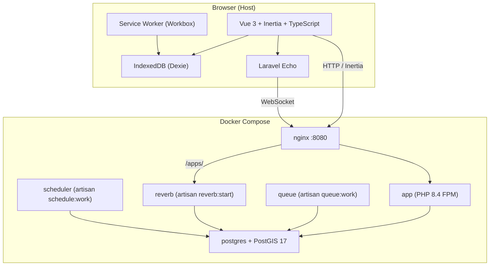
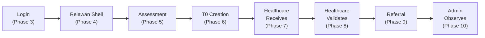

# RAPID-MIND — Implementation Plan (Revised)

> Corrected to follow AGENTS.md mandatory Docker workflow.
> All PHP/Composer/Laravel commands run via `docker compose exec -T app`.
> Only Node/npm runs on the host.

---

## Goal Description

Build a working end-to-end RAPID-MIND demo prototype following the **critical demo path** defined in AGENTS.md:

```text
Relawan
→ patient / assessment
→ SRQ-20
→ risk factors
→ daily function
→ system triage recommendation
→ T0-Suspect
→ Healthcare receives emergency
→ Healthcare validates
→ referral / follow-up
→ Admin observes aggregate operational state
```

RAPID-MIND is one repository, one Laravel application, one user-facing website, three role-specific experiences (RELAWAN, HEALTHCARE, ADMIN).

---

## Current State

The codebase is a **bare scaffold**:
- Docker infrastructure exists and works: `app`, `queue`, `scheduler`, `reverb`, `nginx`, `postgres` (PostGIS 17-3.5)
- Dockerfile at [`docker/php/Dockerfile`](file:///home/saga/coding/rapid-mind/docker/php/Dockerfile) — PHP 8.4-FPM with pdo_pgsql, Composer
- [`compose.yaml`](file:///home/saga/coding/rapid-mind/compose.yaml) — 6 services, PostgreSQL healthcheck, Nginx on port 8080
- [`.env`](file:///home/saga/coding/rapid-mind/.env) — PostgreSQL connection configured, Reverb configured
- [`nginx/default.conf`](file:///home/saga/coding/rapid-mind/nginx/default.conf) — reverse proxy to PHP-FPM + Reverb WebSocket passthrough
- Frontend: Vue 3 + Inertia + TypeScript + Tailwind CSS 4 + Echo
- Only code: one placeholder `Setup.vue` page, default User model, default migrations
- **No domain models, no routes, no auth, no triage logic, no role pages**

---

## Mandatory Docker Workflow

> [!CAUTION]
> Per AGENTS.md: **Never** use bare `php artisan` or `composer` commands. All PHP/Composer/Laravel operations run inside the `app` Docker container.

```bash
# Backend commands — always through Docker
docker compose exec -T app php artisan migrate
docker compose exec -T app php artisan test
docker compose exec -T app php artisan route:list
docker compose exec -T app composer require <package>
docker compose exec -T app composer install

# Frontend commands — host Node/npm is allowed
npm install <package>
npm run build
```

---

## Resolved Decisions

| Question | Decision |
|---|---|
| **JWT Package** | `php-open-source-saver/jwt-auth` — install via `docker compose exec -T app composer require php-open-source-saver/jwt-auth` |
| **STT for SRQ-20** | Browser Web Speech API — free, no API key, works in Chrome/Edge |
| **Test Framework** | PHPUnit (already installed) — no Pest for this demo sprint |
| **MapLibre Tiles** | OpenStreetMap raster tiles (free, no API key) |

---

## Proposed Changes

Phases follow AGENTS.md **Demo Build Priority**:

```text
1. Application starts reliably
2. Minimal domain/database structure
3. Login and role entry
4. Relawan workflow
5. Assessment and triage
6. T0 creation
7. Healthcare realtime reception
8. Healthcare validation
9. Referral / follow-up
10. Admin aggregate visibility
```

---

### Phase 1 — Application Starts Reliably

**Goal:** Docker containers up, PostgreSQL connected, default migration runs, Vite builds, app loads at `http://localhost:8080`.

**Current status:** Mostly done. Docker infra exists but needs verification that everything starts cleanly and migrations run against PostgreSQL.

#### Tasks

1. Verify Docker startup:
   ```bash
   docker compose up -d --build
   ```

2. Run existing migrations:
   ```bash
   docker compose exec -T app php artisan migrate
   ```

3. Verify frontend build:
   ```bash
   npm run build
   ```

4. Verify app loads at `http://localhost:8080`

#### [MODIFY] `.env.example`

Ensure it matches the Docker PostgreSQL config (already largely done, verify consistency).

**Exit criteria:** `docker compose up -d --build` → app loads in browser → no errors.

---

### Phase 2 — Minimal Domain / Database Structure

**Goal:** Core domain tables + Eloquent models needed for the demo path.

#### [NEW] Database migrations (via Docker)

```bash
docker compose exec -T app php artisan make:migration create_regions_table
docker compose exec -T app php artisan make:migration create_shelters_table
# ... etc
docker compose exec -T app php artisan migrate
```

Tables needed for the demo path:

```text
# Core identity / organization
regions                   (id, name, geometry)
shelters                  (id, region_id, name, location geometry, address)
healthcare_facilities     (id, name, type, address, is_active)

# Users (extend existing)
+role                     (enum: RELAWAN, HEALTHCARE, ADMIN)
+token_version            (integer, default 1)
+is_active                (boolean, default true)
+facility_id              (nullable FK → healthcare_facilities)
+shelter_id               (nullable FK → shelters, for Relawan Posko assignment)

# Patient
patients                  (uuid PK, nik, name, age, gender, shelter_id, created_by)

# Assessment
assessments               (uuid PK, patient_id, user_id, status, mode, started_at, completed_at)
srq_responses             (assessment_id, question_number 1–20, answer boolean)
risk_responses            (assessment_id, indicator R1–R5, answer boolean)
function_responses        (assessment_id, domain F1–F3, level 0|1|3)
triage_results            (assessment_id, srq_score, risk_score, function_score, total_score, system_recommendation)

# Emergency
emergency_events          (uuid PK, patient_id nullable, assessment_id nullable, user_id, red_flag_type, status, location geometry, shelter_id, created_at)
emergency_verifications   (emergency_event_id, verified_by, method, clinical_result, notes, created_at)

# Clinical / Referral
clinical_validations      (assessment_id, validated_by, clinical_result, diagnosis_notes, intervention_plan, referral_required)
referrals                 (uuid PK, emergency_event_id nullable, patient_id, referred_by, status, created_at)
referral_status_history   (referral_id, status, changed_by, notes, created_at)

# System
audit_logs                (id, actor_id, action, entity_type, entity_id, old_values, new_values, created_at)
```

Key rules (from AGENTS.md / technical plan):
- UUIDs for major entities (patient, assessment, emergency, referral)
- NIK is a patient identifier, **not** a primary key
- `system_recommendation` and `clinical_result` stored **separately** — never overwrite
- Emergency events are **separate** from assessment records
- PostGIS `geometry(Point, 4326)` for shelter locations and GPS coordinates

#### [NEW] `app/Models/` — Eloquent models

```text
Region.php
Shelter.php
HealthcareFacility.php
Patient.php
Assessment.php
SrqResponse.php
RiskResponse.php
FunctionResponse.php
TriageResult.php
EmergencyEvent.php
EmergencyVerification.php
ClinicalValidation.php
Referral.php
ReferralStatusHistory.php
AuditLog.php
```

#### [NEW] `app/Enums/`

```text
UserRole.php           (RELAWAN, HEALTHCARE, ADMIN)
TriageCategory.php     (T0_SUSPECT, T0_CONFIRMED, T1, T2, T3)
EmergencyStatus.php    (PENDING, ACKNOWLEDGED, REVIEWING, CONFIRMED, DOWNGRADED, RESOLVED)
RedFlagType.php        (SUICIDAL_IDEATION, PSYCHOSIS, SEVERE_AGITATION, MEDICAL_CRISIS)
AssessmentStatus.php   (IN_PROGRESS, COMPLETED)
ReferralStatus.php     (ACTIVE, EN_ROUTE, ON_SITE, TRANSPORT, COMPLETED)
```

#### [NEW] `database/seeders/DemoSeeder.php`

Seeded demo accounts (acceptable demo shortcut per AGENTS.md):

```text
Admin:      admin@rapidmind.id / password
Relawan:    relawan@rapidmind.id / password    → assigned to Posko Candi
Healthcare: nakes@rapidmind.id / password      → assigned to RSUD Candi

+ 1 Region, 3 Shelters, 1 Healthcare Facility
+ 5 sample patients with assessments
```

```bash
docker compose exec -T app php artisan db:seed --class=DemoSeeder
```

**Exit criteria:** `docker compose exec -T app php artisan migrate:status` shows all migrations ran. Models load. Seed data present.

---

### Phase 3 — Login and Role Entry

**Goal:** JWT auth, login page, post-login role routing, RBAC middleware.

#### [NEW] JWT infrastructure

```bash
docker compose exec -T app composer require php-open-source-saver/jwt-auth
docker compose exec -T app php artisan vendor:publish --provider="PHPOpenSourceSaver\JWTAuth\Providers\LaravelServiceProvider"
docker compose exec -T app php artisan jwt:secret
```

#### [NEW] `app/Domain/Auth/`

```text
JwtService.php                 # issue access/refresh tokens
RefreshTokenRepository.php     # database-backed refresh token store
```

#### [NEW] Migrations

```text
create_refresh_tokens_table    (jti, user_id, expires_at, revoked_at)
```

#### [NEW] `app/Http/Middleware/`

```text
AuthenticateJwt.php            # verify Bearer access token
RequireRole.php                # enforce role:RELAWAN|HEALTHCARE|ADMIN
```

#### [NEW] `app/Http/Controllers/AuthController.php`

```php
POST /api/auth/login      → validate credentials, return access + refresh tokens
POST /api/auth/refresh    → rotate refresh token, return new access token
POST /api/auth/logout     → revoke refresh token
```

#### [MODIFY] `routes/web.php`

```php
Route::get('/login', fn () => Inertia::render('Auth/Login'));

Route::middleware(['auth.jwt', 'role:RELAWAN'])->prefix('relawan')->group(function () {
    Route::get('/home', fn () => Inertia::render('Relawan/Home'));
    // ... assessment routes
});

Route::middleware(['auth.jwt', 'role:HEALTHCARE'])->prefix('healthcare')->group(function () {
    Route::get('/emergencies', fn () => Inertia::render('Healthcare/Emergencies/Index'));
    // ...
});

Route::middleware(['auth.jwt', 'role:ADMIN'])->prefix('admin')->group(function () {
    Route::get('/summary', fn () => Inertia::render('Admin/Summary'));
    // ...
});
```

#### [NEW] `resources/js/Pages/Auth/Login.vue`

Universal login — Bahasa Indonesia copy:
- `Email atau username` + `Kata sandi` fields
- `MASUK` button
- States: idle, submitting (`Memeriksa akses…`), credential error, server error, network error
- Post-login routing: ADMIN→`/admin/summary`, RELAWAN→`/relawan/home`, HEALTHCARE→`/healthcare/emergencies`
- No role selector, no public registration

#### [NEW] `resources/js/stores/auth.ts`

Stores access token in memory (not localStorage). Role, user context. Handles refresh flow.

#### Verification

```bash
docker compose exec -T app php artisan test tests/Feature/Auth/
docker compose exec -T app php artisan route:list
npm run build
```

**Exit criteria:** Three seeded users can log in and are redirected to their correct role workspace. Wrong-role URL access is blocked.

---

### Phase 4 — Relawan Workflow (Shell + PFA + Navigation)

**Goal:** Mobile-first Relawan shell with bottom nav, persistent T0 button, PFA guide, Beranda, Data workspace.

#### [NEW] `resources/js/layouts/RelawanLayout.vue`

```text
┌─────────────────────────────────┐
│  RAPID-MIND        Tersinkron ✓ │  ← top bar with operational status
│  Posko Candi                    │
├─────────────────────────────────┤
│                                 │
│         [page content]          │
│                                 │
│     ┌──────────────────────┐    │
│     │  ⚠ T0 DARURAT        │    │  ← persistent floating pill (#991B1B)
│     └──────────────────────┘    │
├─────────────────────────────────┤
│  Beranda  PFA  Asesmen  Data   │  ← bottom nav (4 items, NOT 5)
└─────────────────────────────────┘
```

- T0 is **not** a bottom-nav item — it's a persistent floating pill
- No permanent pulsing/flashing on the T0 button
- Bottom nav items have icons + explicit text labels, ≥56px tap targets
- Contextual header during focused tasks (e.g., `← Asesmen   Offline • 2`)

#### [NEW] Relawan pages

| File | Route | Purpose |
|---|---|---|
| `Pages/Relawan/Home.vue` | `/relawan/home` | Beranda — resume incomplete work, quick-start PFA/Asesmen |
| `Pages/Relawan/Pfa.vue` | `/relawan/pfa` | PFA guide — LOOK / LISTEN / LINK sections |
| `Pages/Relawan/Data.vue` | `/relawan/data` | Operational data — grouped by Sedang Dikerjakan / Menunggu Sinkronisasi / Tersinkron |

#### [NEW] Visual foundation in `resources/css/app.css`

```css
@import url('./fonts/inter.css');

:root {
  --color-ink:      #0F172A;
  --color-primary:  #0F766E;
  --color-muted:    #64748B;
  --color-canvas:   #F1F5F9;
  --color-surface:  #FFFFFF;
  --color-t0: #991B1B;
  --color-t1: #C2410C;
  --color-t2: #A16207;
  --color-t3: #15803D;
}
```

Inter Variable font self-hosted in `resources/fonts/`.

#### [NEW] `resources/js/components/ui/` — shared UI primitives

```text
Button.vue, Badge.vue, Card.vue, StatusIndicator.vue,
Toast.vue, BottomSheet.vue, Dialog.vue, Spinner.vue
```

**Exit criteria:** Relawan shell renders on mobile viewport. Bottom nav works. PFA guide shows LOOK/LISTEN/LINK content. T0 button is visible and persistent.

---

### Phase 5 — Assessment and Triage

**Goal:** Full assessment workflow (Identity → SRQ-20 → Risk → Function → Review → Result) with working triage engine.

#### [NEW] Triage engine — PHP (canonical, server-side)

```text
app/Domain/Triage/
├── SrqCalculator.php         # count of YA answers (0–20)
├── RiskCalculator.php        # weighted sum (0–8): R1=2, R2=2, R3=1, R4=2, R5=1
├── FunctionCalculator.php    # sum of domain levels (0–9): each domain 0|1|3
├── TriageCalculator.php      # orchestrates all three, returns TriageResult
├── RedFlagDetector.php       # Q17=YES or manual trigger → T0
└── TriageResult.php          # value object
```

Thresholds (from `workflow.md`):
```text
T0 = Red Flag override (Q17=YES OR floating button pressed) — bypasses score
T1 = total ≥ 15 OR function_score ≥ 6
T2 = 7–14
T3 = 0–6
```

#### [NEW] Triage engine — TypeScript (client-side, for offline)

```text
resources/js/domain/triage/
├── srqCalculator.ts
├── riskCalculator.ts
├── functionCalculator.ts
├── triageCalculator.ts
├── redFlagDetector.ts
└── triageResult.ts
```

Must produce **identical results** to PHP for the same inputs.

#### [NEW] Assessment pages

```text
Pages/Relawan/Assessment/Index.vue       (/relawan/assessment)           — start/resume
Pages/Relawan/Assessment/Identity.vue    (/relawan/assessment/:id/identity)
Pages/Relawan/Assessment/Srq.vue         (/relawan/assessment/:id/srq)
Pages/Relawan/Assessment/Risk.vue        (/relawan/assessment/:id/risk)
Pages/Relawan/Assessment/Function.vue    (/relawan/assessment/:id/function)
Pages/Relawan/Assessment/Review.vue      (/relawan/assessment/:id/review)
Pages/Relawan/Assessment/Result.vue      (/relawan/assessment/:id/result)
```

**SRQ-20** (`Srq.vue`):
- One continuous scrollable page (not 20 separate screens)
- Verbal / Non-Verbal mode toggle
- Verbal mode: Web Speech API, one continuous interview session, assistive not authoritative
- `YA` / `TIDAK` large touch buttons (Teal selected state, ≥56px height)
- Q17 → triggers Potential Red Flag interruption overlay
- Progress: "SRQ-20 • 8 dari 20" (answered count)
- Manual answer always authoritative over STT
- STT failure does NOT block manual SRQ completion

**Faktor Risiko** (`Risk.vue`): 5 items, weighted, large touch checkboxes

**Fungsi Harian** (`Function.vue`): 3 domains × 3 choices (full-width radio rows, no dropdowns)

**Hasil Rekomendasi** (`Result.vue`):
- Score breakdown (SRQ + Risk + Function = Total)
- System recommendation T1/T2/T3
- Disclaimer: "Rekomendasi Sistem — menunggu Validasi Klinis oleh Tenaga Kesehatan"

#### [NEW] Backend API endpoints

```php
// routes/api.php — within auth.jwt + role:RELAWAN middleware
POST   /api/relawan/patients                    → create patient
GET    /api/relawan/patients/{id}                → get patient
POST   /api/relawan/assessments                  → create assessment
PUT    /api/relawan/assessments/{id}              → update assessment
POST   /api/relawan/assessments/{id}/complete     → finalize + server triage recalculation
```

Server **always recalculates** triage — never trusts client-provided scores.

#### [NEW] Triage tests

```bash
docker compose exec -T app php artisan test tests/Unit/Triage/
```

Test fixtures covering: T0 override, T1 by score (≥15), T1 by functional override (≥6), T2 boundary, T3, edge cases.

**Exit criteria:** Full assessment works end-to-end. Triage engine returns correct T1/T2/T3. PHP and TypeScript produce identical results for same fixtures.

---

### Phase 6 — T0 Emergency Creation

**Goal:** Relawan can trigger T0-Suspect with verification gates, persist locally, transmit to server.

#### [NEW] T0 interaction components

```text
components/Relawan/T0Button.vue           — persistent floating pill
components/Relawan/T0Verification.vue     — full-height task sheet (3 verification groups)
components/Relawan/T0PatientSelector.vue  — search/select/unidentified
components/Relawan/PotentialRedFlag.vue   — safety interruption overlay (Q17 trigger)
```

T0 Verification groups:
1. **Penyintas** — known patient / current assessment patient / unidentified
2. **Alasan Darurat** — Red Flag type selection (suicidal ideation, psychosis, severe agitation, medical crisis)
3. **Lokasi & Kirim** — GPS → assigned Posko → manual fallback (GPS failure does NOT block T0)

First tap on T0 button opens verification — does **not** transmit anything.

#### [NEW] `Pages/Relawan/Emergency.vue` (`/relawan/emergencies/:id`)

Route-level persistent incident screen. Shows 3 separate state axes:
- Local persistence state (`Tersimpan di perangkat`)
- Transmission state (`Menunggu sinkronisasi` / `Tersinkron`)
- Healthcare response state (`Belum diakui` / `Sudah diakui`)

#### [NEW] Backend

```php
POST   /api/relawan/emergencies                 → create T0-Suspect event
GET    /api/relawan/emergencies/{id}             → get emergency state
```

`EmergencyCreated` event → broadcast via Reverb on `private-healthcare.facility.{facilityId}`.

**Exit criteria:** T0 button → verification → T0-Suspect created → server receives → Reverb broadcasts event.

---

### Phase 7 — Healthcare Realtime Reception

**Goal:** Healthcare dashboard receives T0 alerts in realtime via Reverb/Echo.

#### [NEW] `resources/js/layouts/HealthcareLayout.vue`

Desktop sidebar: Darurat | Validasi | Rujukan | Pasien. Landing = Darurat.

#### [NEW] Healthcare pages

```text
Pages/Healthcare/Emergencies/Index.vue   (/healthcare/emergencies)      — emergency worklist
Pages/Healthcare/Emergencies/Show.vue    (/healthcare/emergencies/:id)  — selected incident workspace
```

**Darurat Worklist**: Queue groups (Perlu Respons | Sedang Ditangani | Tindak Lanjut), priority T0 first → unacknowledged → oldest.

**New T0 Alert**: Finite audio signal, visible badge/count, no indefinite alarm, no forced navigation.

**Selected Incident Workspace**: Emergency summary, patient identity, Relawan/Posko context, location, timeline.

Realtime via Laravel Echo:
```typescript
Echo.private(`healthcare.facility.${facilityId}`)
    .listen('EmergencyCreated', (e) => { /* add to queue */ });
```

**Exit criteria:** Relawan creates T0 → Healthcare dashboard shows the alert in realtime without page refresh.

---

### Phase 8 — Healthcare Validation

**Goal:** Healthcare can acknowledge, verify, and classify T0 cases.

#### Handling lifecycle

```text
Belum diakui → Sudah diakui → Sedang ditinjau
```

Opening/viewing ≠ acknowledgement. Explicit `AKUI KASUS` action required.

#### Clinical lifecycle

```text
T0-Suspect → T0-confirmed | T1 | T2
```

No T3 downgrade from T0 verification.

Secondary verification records **method** (Telepon / Video / Langsung) — no integrated calling engine needed for MVP.

#### [NEW] Backend endpoints

```php
POST /api/healthcare/emergencies/{id}/acknowledge     → acknowledge
POST /api/healthcare/emergencies/{id}/verify           → start secondary verification
POST /api/healthcare/emergencies/{id}/classify         → T0-confirmed | T1 | T2
```

All mutations require server confirmation. No offline Healthcare mutation queue.

#### [NEW] Non-T0 Clinical Validation

```text
Pages/Healthcare/Validations/Index.vue    (/healthcare/validations)
Pages/Healthcare/Patients/Show.vue        (/healthcare/patients/:id)
```

Free-text `Catatan diagnosis medis` (no diagnostic taxonomy — per handoff Section 1.5). Rencana intervensi, rujukan required (Ya/Tidak).

**Exit criteria:** Healthcare can receive, acknowledge, verify, and classify a T0 case. Status transitions are audited.

---

### Phase 9 — Referral / Follow-up

**Goal:** Basic referral lifecycle from Healthcare.

#### [NEW] Referral pages

```text
Pages/Healthcare/Referrals/Index.vue    (/healthcare/referrals)
```

Referral status: Aktif → Menuju Lokasi → Tiba → Transportasi ke RS → Selesai.

#### [NEW] Backend

```php
POST /api/healthcare/referrals                     → create referral
PUT  /api/healthcare/referrals/{id}/status          → update status
```

**Exit criteria:** Healthcare can create and progress referrals. Status history is recorded.

---

### Phase 10 — Admin Aggregate Visibility

**Goal:** Admin can observe the overall system state without accessing patient-specific clinical actions.

#### [NEW] `resources/js/layouts/AdminLayout.vue`

Desktop sidebar: Ringkasan | Peta | Analytics | Relawan | Logistik | Faskes | Akun.

#### [NEW] Admin pages

| File | Route | Purpose |
|---|---|---|
| `Pages/Admin/Summary.vue` | `/admin/summary` | KPI cards: Total Penyintas, T0, T1, T2, T3 |
| `Pages/Admin/Map.vue` | `/admin/map` | MapLibre + PostGIS shelter markers with triage-color coding |
| `Pages/Admin/Analytics.vue` | `/admin/analytics` | ECharts: triage distribution pie, 30-day longitudinal line chart |
| `Pages/Admin/Volunteers.vue` | `/admin/volunteers` | Relawan list, Posko assignment |
| `Pages/Admin/Logistics.vue` | `/admin/logistics` | Resource needs by Posko (intentionally limited) |
| `Pages/Admin/Facilities.vue` | `/admin/facilities` | Faskes organization management |
| `Pages/Admin/Accounts/*.vue` | `/admin/accounts/*` | Account provisioning (Admin creates Relawan + Healthcare accounts) |

Admin must **NOT** perform patient-specific clinical validation, T0 confirmation/downgrade, referral decisions, or dispatch progression.

Frontend dependencies (host npm):
```bash
npm install maplibre-gl echarts vue-echarts
```

**Exit criteria:** Admin sees aggregate KPIs, map with shelter markers, basic analytics. No patient-level clinical actions available.

---

### Phase 11 — Offline Improvements

**Goal:** IndexedDB persistence, sync queue, offline field mode for Relawan.

#### [NEW] IndexedDB / Dexie setup

```bash
npm install dexie
```

```text
resources/js/offline/
├── db.ts            # Dexie database with stores
├── outbox.ts        # priority queue (T0 first)
├── syncManager.ts   # sync triggers: submit, online event, visibilitychange, app start
└── stores.ts        # store definitions
```

#### [NEW] `resources/js/composables/useOfflineSync.ts`

Canonical states:
- `Tersinkron` (Teal)
- `Menyinkronkan 3 data…` (Teal)
- `Offline • 3 data tersimpan` (Slate)
- `2 data belum tersinkron` (warning)
- `Data belum tersimpan di perangkat` (error — most severe)

#### [NEW] PWA / Service Worker

```bash
npm install vite-plugin-pwa
```

Workbox-based service worker for app shell caching. PWA manifest with RAPID-MIND branding.

#### [NEW] `resources/js/composables/useAuthOffline.ts`

Separates `AUTHENTICATED` from `OFFLINE_FIELD_MODE`. Expired token while offline → remain in local field mode, do NOT purge local data. Auth failure → "Perlu masuk kembali untuk sinkronisasi. Data tetap aman di perangkat."

**Exit criteria:** Assessment survives browser reload, offline operation. Sync resumes when connectivity returns.

---

### Phase 12 — STT / Visual Polish / Security Hardening

Per AGENTS.md, these come last:

- **STT**: Web Speech API integration for SRQ-20 verbal interview mode
- **Visual polish**: Consistent design system, responsive refinements
- **Security hardening**: Rate limiting, CSRF, security headers, audit log coverage (deferred for demo if blocking)

---

## Architecture Diagram



---

## Screen Inventory Summary

### Relawan (Mobile PWA)

| Route | Screen | MVP |
|---|---|---|
| `/login` | Universal Login | ✅ |
| `/relawan/home` | Beranda | ✅ |
| `/relawan/pfa` | PFA Guide (LOOK/LISTEN/LINK) | ✅ |
| `/relawan/assessment` | Assessment Entry (start/resume) | ✅ |
| `/relawan/assessment/:id/identity` | Identitas Penyintas | ✅ |
| `/relawan/assessment/:id/srq` | SRQ-20 (Verbal/Non-Verbal + STT) | ✅ |
| `/relawan/assessment/:id/risk` | Faktor Risiko | ✅ |
| `/relawan/assessment/:id/function` | Fungsi Harian | ✅ |
| `/relawan/assessment/:id/review` | Tinjau | ✅ |
| `/relawan/assessment/:id/result` | Hasil Rekomendasi | ✅ |
| `/relawan/data` | Data workspace | ✅ |
| `/relawan/data/patients/:id` | Patient Detail | Supporting |
| `/relawan/emergencies/:id` | Active T0 Incident | ✅ |
| (overlay) | T0 Verification sheet | ✅ |
| (overlay) | Potential Red Flag interruption | ✅ |

### Healthcare (Desktop)

| Route | Screen | MVP |
|---|---|---|
| `/healthcare/emergencies` | Darurat Worklist | ✅ |
| `/healthcare/emergencies/:id` | Selected Emergency Workspace | ✅ |
| `/healthcare/validations` | Clinical Validation | ✅ |
| `/healthcare/referrals` | Referral Queue | ✅ |
| `/healthcare/patients` | Patient List | Supporting |
| `/healthcare/patients/:id` | Patient Clinical Detail | Supporting |

### Admin (Desktop)

| Route | Screen | MVP |
|---|---|---|
| `/admin/summary` | Ringkasan (KPIs) | ✅ |
| `/admin/map` | Peta Geospasial | ✅ |
| `/admin/analytics` | Analytics + 30-day trend | ✅ |
| `/admin/volunteers` | Manajemen Relawan | ✅ |
| `/admin/logistics` | Manajemen Logistik | Supporting |
| `/admin/facilities` | Manajemen Faskes | ✅ |
| `/admin/accounts/*` | Account provisioning | ✅ |

---

## Verification Plan

### Automated Tests

All backend tests via Docker:

```bash
# Unit tests — triage engine, JWT, calculators
docker compose exec -T app php artisan test tests/Unit/

# Feature tests — auth, endpoints, T0 flow, role guards
docker compose exec -T app php artisan test tests/Feature/

# Route verification
docker compose exec -T app php artisan route:list

# Migration status
docker compose exec -T app php artisan migrate:status
```

Frontend verification via host npm:

```bash
# TypeScript type checking
npx vue-tsc --noEmit

# Vite build
npm run build
```

### Manual Verification

1. `docker compose up -d --build` → all 6 services healthy
2. Login as each of 3 seeded users → correct redirect
3. Full assessment end-to-end: Identity → SRQ-20 → Risk → Function → Review → Result
4. T0 online flow: Relawan triggers T0 → Healthcare dashboard receives realtime alert
5. Healthcare validates: acknowledge → verify → classify
6. Admin sees KPI cards, map markers

### Explicitly NOT Verified (per AGENTS.md)

```text
browser tested (beyond basic functional checks)
E2E tested
offline tested (until Phase 11)
realtime tested (until Phase 7)
mobile tested (responsive behavior)
```

---

## Dependencies to Install

### PHP (via Docker)

```bash
docker compose exec -T app composer require php-open-source-saver/jwt-auth
```

### npm (host)

```bash
npm install dexie maplibre-gl echarts vue-echarts vite-plugin-pwa
```

Each dependency will be installed only when its phase begins, not preemptively.

---

## Critical Path (Minimum Viable Demo)



Admin analytics should **not** delay the Relawan → T0 → Healthcare workflow.

A smaller complete workflow is better than many unfinished screens.
